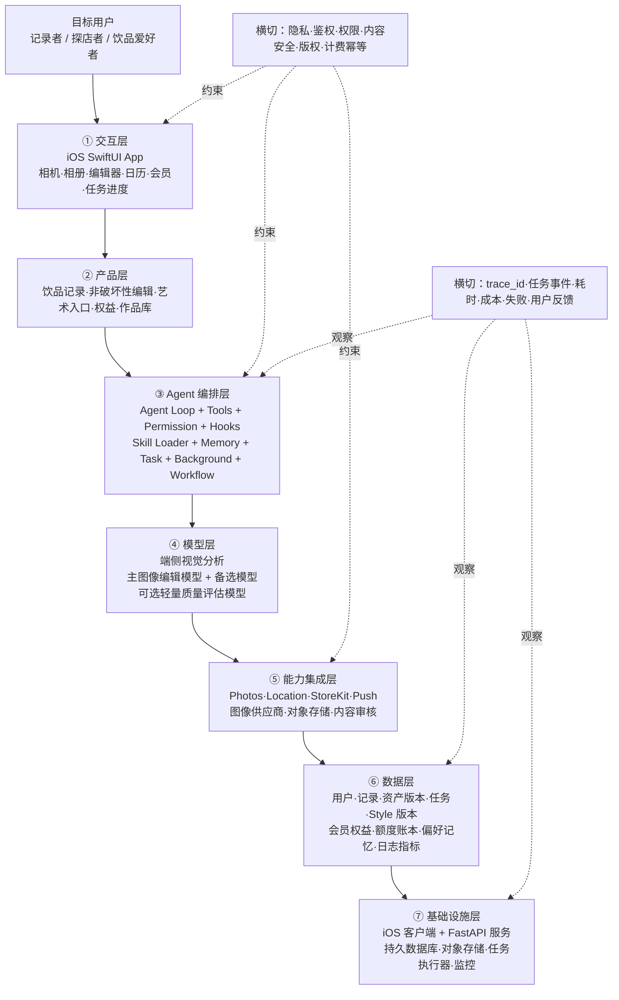
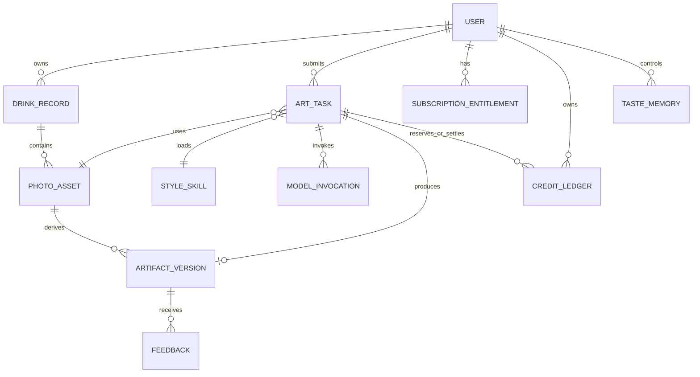

# AI 饮品生活日记产品需求文档（PRD）

> 文档版本：V1.0 方案稿  
> 更新时间：2026-09-02  
> 当前状态：Step 1–4 已完成，待产品确认；尚未进入代码生成  
> 产品名称：吨吨记（已确认）  
> 首发终端：建议 iOS App，是否同时支持 Android 待确认

---

## 0. 一句话执行摘要

面向喜欢记录生活、奶茶与咖啡，审美偏文艺的年轻女性，提供一款“饮品即生活坐标”的照片日记：用户可以永久免费记录、修图、使用精选滤镜和回看日历；订阅会员后，AI 会理解照片内容与个人审美，从少量精选艺术 Skill 中推荐两种最合适的表达，并把照片创作成可收藏、可分享的艺术作品。

核心商业边界：

> 记录生活永久免费，基础修图和普通滤镜永久免费；只有真正消耗生成算力的 AI 艺术化处理进入会员权益。

核心技术边界：

> 模型负责理解照片与创意决策，Harness 负责工具、知识、观察、行动和权限；固定的上传、校验、计费、生成、质检、结算和保存流程由代码工作流控制，不允许模型自行扣次数或绕过安全规则。

---

## 1. 文档方法与信息状态

本文按照 [`agent-blueprint_副本2/BLUEPRINT.md`](agent-blueprint_副本2/BLUEPRINT.md) 的五步方法生成：

1. 需求拆解：提取硬事实，缺失内容标“待确认”。
2. 领域建模：映射到工具、知识、观察、行动、权限。
3. 组件选型：只采用没有就会导致产品失败的 Harness 组件。
4. 架构设计：形成七层架构、工具、记忆、安全、工作流与部署方案。
5. 代码生成：必须在本 PRD 和架构确认后再开始。

信息标签：

- `【已确认】`：来自用户明确要求、公开产品页面或可复核本地资料。
- `【合理推断】`：由已有信息推导，但仍需要真实用户或数据验证。
- `【建议设计】`：为形成完整产品而提出，尚未得到产品负责人最终确认。
- `【待确认】`：当前信息不足，会影响范围、成本或技术路线。

---

## 2. 证据与输入台账

| 编号 | 来源 | 已确认信息 | 限制 |
|---|---|---|---|
| E01 | 本项目对话 | 目标用户喜欢记录生活、奶茶和咖啡；核心偏文艺青年女性；拍照后希望艺术化；艺术 Skill 数量应少而精选；免费层提供普通滤镜和修图；AI 艺术化采用会员制；PRD 必须明确用户需求与痛点 | 尚无用户访谈和行为数据 |
| E02 | [Brewwww! App Store 页面](https://apps.apple.com/my/app/brewwww/id6761394593) | 参考产品以饮品照片、日历、Momento、地图、护照、印章、挑战、收藏统计构成记录闭环 | 只能证明公开功能与文案，不能证明其收入、留存或内部实现 |
| E03 | [`agent-blueprint_副本2`](agent-blueprint_副本2/README.md) | Agent = 模型 + Harness；Harness = 工具 + 知识 + 观察 + 行动 + 权限；先方案后代码；固定流程使用工作流运行时 | 是工程方法，不等于本产品已经实现 |
| E04 | 本地 `img2img-studio` StyleSpec | 已有极简 ZINE、照片遗物双联、水彩旅行卡等可复核风格定义、来源和质量规则 | 仍需以目标用户照片做真实模型评测 |
| E05 | 本地 `muse` 验证资料 | `80s-cn-art` 已通过“用户照片 + 多张风格参考图”的图生图链路验证；会改变人物照片级五官 | 原参考图仅适合风格研究，商业上线前必须替换成授权资产 |
| E06 | [Apple App Review Guidelines](https://developer.apple.com/app-store/review/guidelines/) | 自动续订订阅必须持续提供价值；数字权益需要使用合适的应用内购买类型 | 具体价格和转化仍需实验 |
| E07 | [fal FLUX Kontext 当前页面](https://fal.ai/models/fal-ai/flux-pro/kontext) | 当前可作为成本参照的图像编辑价格为约 0.04 美元/张 | 价格会变化，正式开发必须从配置和实时成本台账读取 |
| E08 | 工作区技术与部署手册 | 长任务需持久化、图片走对象存储、密钥只在后端、双层测试、状态可恢复、费用动作需确定性校验 | 技术路线需按 iOS 产品形态适配，不能机械照搬 Web 默认值 |

---

## 3. Step 1：需求拆解——硬事实与待确认项

| 维度 | 结论 | 状态 |
|---|---|---|
| 产品目标 | 让用户用一杯饮品记录一次真实生活，并能将部分照片转化为具有个人审美的艺术作品 | 【已确认】 |
| 核心用户 | 喜欢记录生活、咖啡、奶茶和探店的年轻人；主要聚焦文艺审美的女性群体 | 【已确认】 |
| 核心痛点 | 照片散落、记录缺乏情绪价值、修图选择负担、通用 AI 创作门槛高、回忆难以沉淀 | 【合理推断，待访谈验证】 |
| 核心需求 | 用低操作成本完成好看的饮品记录，并在需要时获得贴合照片、保留边界清楚的 AI 艺术作品 | 【合理推断，待访谈验证】 |
| 现有替代 | 系统相册、社交平台、通用修图 App、备忘录/手账、通用 AI 生图工具之间来回切换 | 【合理推断，待访谈验证】 |
| 高频行为 | 拍摄或选择照片、简单修图、记录饮品与当日感受、回看日历 | 【合理推断】 |
| 核心闭环 | 拍照/选图 → 免费修图或选择 AI 艺术化 → 补充饮品信息 → 保存为当天记忆 → 日历/合集回看 → 分享 | 【已确认+建议设计】 |
| 免费边界 | 记录、普通滤镜、基础修图应免费 | 【已确认】 |
| 付费边界 | 真正调用生成模型的 AI 艺术化采用会员制 | 【已确认】 |
| 艺术风格数量 | 首发少量精选，不让用户面对大规模风格瀑布流；AI 每次只推荐两个 | 【已确认+建议设计】 |
| 隐私边界 | 免费本地修图不上传照片；AI 上云前明确提示；照片不得默认用于训练 | 【建议设计】 |
| 成本边界 | 不提供无约束的无限云端生成；生成失败不扣次数；所有扣次由服务端账本决定 | 【建议设计】 |
| 首发市场 | 中国大陆、港澳台、马来西亚或全球 | 【待确认】 |
| 交付终端 | iOS 优先；Android 是否同期 | 【待确认】 |
| 产品名称与品牌 | 名称、Logo、主色、语气 | 【待确认】 |
| 模型供应商 | Seedream、FLUX、其他图像编辑服务的最终主备路由 | 【待确认】 |
| 会员定价 | 商业结构已明确，具体价格与月度次数需要成本和付费实验确认 | 【部分确认】 |

### 3.1 蓝图八问

1. **要达成什么？** 让饮品记录从信息登记升级成有审美、有情绪、愿意回看的生活作品。
2. **给谁用？** 主要是文艺审美年轻女性，同时兼容其他咖啡、奶茶和生活记录用户。
3. **一次完整交付是什么？** 一条包含原图或艺术图、饮品信息、日期、地点、文字与情绪的可保存记录。
4. **需要什么外部动作？** 相册/相机、定位、图片生成 API、对象存储、StoreKit、推送和地图。
5. **领域知识在哪里？** 艺术 StyleSpec、饮品分类、构图规则、人物/饮品保真规则、版权与安全规则。
6. **绝对不能做什么？** 未经同意上传照片；重复扣次；生成失败仍扣次；泄露密钥；把参考图代码许可误当成素材商用许可；用用户照片训练而未单独授权。
7. **失败怎么办？** 任务可恢复，失败释放次数，保留原记录，允许有限重试或降级使用免费滤镜。
8. **怎么算成功？** 用户能完成记录闭环，免费编辑流畅，AI 成功率与质量达标，会员收入能够覆盖生成和平台成本。

---

## 4. 产品定位

### 4.1 定位语

> 不是喝水打卡，也不是通用修图软件，而是一位懂饮品、懂照片、也逐渐懂你审美的 AI 生活编辑。

### 4.2 用户价值

| 价值 | 用户得到什么 |
|---|---|
| 记录价值 | 一杯饮品与真实日期、地点、人物和情绪绑定，不再散落在相册里 |
| 审美价值 | 不需要学习复杂修图，免费滤镜即可稳定获得适合饮品的画面 |
| 创作价值 | AI 不让用户盲选几十个效果，而是根据照片推荐最合适的两种艺术表达 |
| 回忆价值 | 日历、合集、地图和月度刊物让零散照片形成可回看的生活轨迹 |
| 收藏价值 | 艺术作品、印章、月份封面和地点记录共同形成个人饮品档案 |

### 4.3 差异化

| 参照类型 | 常见能力 | 本产品差异 |
|---|---|---|
| 饮品打卡 App | 数量、咖啡因、日历、店铺 | 把“记了什么”升级为“这一刻如何被表达” |
| 通用滤镜 App | 大量滤镜、参数、模板 | 饮品与咖啡馆场景专用；选择更少；AI 推荐而非人工翻找 |
| 通用 AI 生图 App | 提示词、模型、风格市场 | 用户不需要理解 Prompt、Skill 和模型；从真实生活记录进入创作 |
| 社交平台 | 发布、点赞、推荐 | 以私人记录和回忆为先，社交不是 P0 前提 |

---

## 5. 目标用户与典型场景

### 5.1 核心用户画像

**画像 A：文艺生活记录者（核心）**

- 18–35 岁女性为主。
- 经常拍咖啡、奶茶、甜品、桌面、书、花和街景。
- 喜欢胶片、水彩、ZINE、纸张、复古印刷等视觉语言。
- 相册很多，但很少系统整理。
- 不一定懂修图参数，希望快速得到“像自己”的结果。

**画像 B：探店与城市漫游者**

- 记录店铺、城市、旅行和朋友聚会。
- 在意地点、店名、时间和分享卡片。
- 希望回看“去过多少家店、在哪些城市喝过什么”。

**画像 C：饮品爱好者**

- 对咖啡豆、茶底、甜度、奶型、风味有持续记录需求。
- 更关注条目可检索、收藏、复购和个人口味变化。

### 5.2 痛点依据与验证边界

当前只有目标用户方向和产品设想，没有完成真实用户访谈。因此以下痛点属于 `【合理推断】`，不是已经被数据证明的用户事实。它们来自三条推导：

1. 用户喜欢拍摄饮品和生活，但产品需要解决“拍完以后发生什么”。
2. 参考产品通过日历、Momento、地图和护照解决沉淀问题，说明“回看与收藏”是这一品类的重要任务，但不能据此证明本产品用户也有相同强度的需求。
3. 用户明确要求免费滤镜、少量艺术 Skill 和会员 AI，说明选择负担、免费日常使用与高成本创作之间必须形成清楚边界。

上线前至少访谈 8–12 位目标用户，并用一周照片日记测试验证：她们是否真的会记录、在哪一步放弃、愿意为什么付费。访谈问题见 5.8。

### 5.3 核心用户痛点假设

| 痛点编号 | 用户现在的困扰 | 当前通常怎么凑合 | 为什么现有办法不够 | 严重度假设 |
|---|---|---|---|---|
| P-01 照片散落 | 拍了很多咖啡、奶茶和店铺照片，几天后就被相册里的截图和工作图片淹没 | 放在系统相册，偶尔建相簿 | 只有图片，没有饮品、地点、人物和当天心情；以后很难按生活线索回看 | 高 |
| P-02 记录像填表 | 普通打卡产品强调杯数、热量或字段，记录过程缺少审美和情绪反馈 | 备忘录、表格、打卡 App，写几天后放弃 | 记录带来的即时满足太弱，填写成本高于回报 | 高 |
| P-03 修图选择疲劳 | 想把照片修得有氛围，但面对几十上百个滤镜和参数不知道选哪个 | 在相册、美图、VSCO 等工具之间反复试 | 需要审美判断和时间；修完还要回到另一个 App 写记录 | 高 |
| P-04 AI 创作门槛高 | 对 AI 艺术化有兴趣，但不懂 Prompt、模型、参考图和重绘强度 | 使用通用 AI 生图产品或直接放弃 | 操作语言技术化；结果可能不像本人、杯子变形或风格不稳定；失败原因不清楚 | 高 |
| P-05 生活上下文丢失 | 过一段时间只记得“喝过”，想不起在哪、和谁、当时为什么喜欢 | 翻聊天记录、定位或社交平台 | 信息分散在不同应用，无法围绕“一杯饮品”形成完整记忆 | 中高 |
| P-06 分享制作麻烦 | 想发一张有个人风格的记录，但截图、排版、加日期和文字很费时间 | 用模板 App 拼图或直接发原图 | 产出缺少一致感，制作时间超过分享意愿 | 中 |
| P-07 公开表达有压力 | 喜欢记录，但不想每一次都面对点赞、评论和公共人设 | 只发朋友圈分组、仅自己可见或不发 | 公开平台把私人记录变成内容生产任务，降低持续记录意愿 | 中高 |
| P-08 AI 付费不确定 | 不知道一次生成要花多少、失败是否扣次、会员是否真的值得 | 不购买、只用赠送额度，或在多个产品之间比价 | 计费不透明和失败风险会阻止首次付费 | 高（影响商业闭环） |

### 5.4 用户需求分层

#### 功能需求

| 需求编号 | 用户需要什么 | 对应痛点 | 重要程度 |
|---|---|---|---|
| N-F01 快速记录 | 在碎片时间内用一张照片和最少字段保存这一杯，稍后还能补充 | P-01、P-02 | P0 |
| N-F02 一站式免费修图 | 不离开记录流程就能完成裁剪、调色、滤镜、排版和高清导出 | P-03、P-06 | P0 |
| N-F03 少量精准选择 | 不翻找几十种效果；系统根据照片只推荐两个最适合的艺术方向 | P-03、P-04 | P0 |
| N-F04 可理解的保真边界 | 生成前知道人物、杯子、文字和背景中什么会保留、什么可能变化 | P-04、P-08 | P0 |
| N-F05 可恢复的 AI 生成 | 可以离开等待页面；回来仍看得到进度；失败不丢记录、不错误扣次 | P-04、P-08 | P0 |
| N-F06 有线索地回看 | 能按日期、饮品、店铺、城市和收藏查看，不再只靠相册时间流 | P-01、P-05 | 日历 P0；地图 P1 |
| N-F07 快速分享 | 一键生成带日期、地点和饮品名的统一分享卡 | P-06 | P0 |
| N-F08 清楚的会员价值 | 知道免费功能不会被拿走，会员买到的是哪些 AI 创作、每月多少次、失败如何处理 | P-08 | P0 |

#### 情绪需求

| 需求编号 | 用户希望获得的感受 | 产品回应 |
|---|---|---|
| N-E01 被理解 | “系统知道这张照片适合什么，也逐渐知道我喜欢什么” | 两项推荐、推荐理由、可查看和清除的审美记忆 |
| N-E02 有仪式感 | 普通的一杯饮品也值得被认真保存 | 日期章、照片卡、日历落点、艺术作品和月度回看 |
| N-E03 低压力 | 不需要为了发给别人而记录，也不会因漏填字段而失败 | 私人默认、弱社交、字段大多选填、无连续打卡惩罚 |
| N-E04 保有自己 | 艺术化之后仍能认出这是自己的那天，而不是一张陌生 AI 图 | 原图锚定、保真说明、原图对比、完整重绘风险提示 |
| N-E05 审美自我表达 | 作品具有稳定、克制、文艺的视觉语言，而非廉价特效感 | 少量精选 Skill、质量门和统一分享系统 |

#### 社交需求

| 需求编号 | 用户需要什么 | 产品边界 |
|---|---|---|
| N-S01 轻量表达 | 用一张好看的卡片告诉朋友“我今天在这里喝了这一杯” | P0 提供分享卡，不要求发布到产品公共广场 |
| N-S02 私密连接 | 与朋友或家人交换饮品记录，而不是面对陌生人流量竞争 | P2 才评估好友私密分享 |
| N-S03 身份表达 | 通过长期合集呈现“我的城市、口味和生活审美” | P1 的护照、印章、月度刊物，不做消费排名 |

### 5.5 场景需求卡

| 场景 | 用户与触发 | 当前替代方式 | 当下痛点 | 核心需求 | 产品成功表现 |
|---|---|---|---|---|---|
| S-01 通勤咖啡 | 上班前时间紧，用户顺手拍下一杯咖啡 | 拍完直接留在相册，或匆忙发社交平台 | 没时间修图和填很多信息，之后找不到 | 30 秒内完成好看、最低信息量的记录 | 选图→一键滤镜→自动日期→保存，全程不要求会员 |
| S-02 独处咖啡馆 | 周末阅读、写字或发呆，用户想保留安静情绪 | 修图后发朋友圈，文字另写在备忘录 | 通用滤镜表达不出这一刻，AI 工具又太复杂 | AI 理解留白、光线和环境，只推荐适合的两种艺术表达 | 用户不用写 Prompt 就得到“留白刊物/水彩日记”等可收藏作品 |
| S-03 朋友奶茶局 | 合照中既有人又有饮品 | 美颜后直接发布，或使用卡通滤镜 | 担心 AI 改脸、改变姿势，生成失败还扣费 | 生成前知道人物保真等级，可以选择原片锚定风格 | 系统优先推荐保真方案；完整重绘显示明显风险提示 |
| S-04 城市探店 | 用户到新店或旅行城市，想记录店铺和地点 | 地图收藏、点评 App、照片分开保存 | 地点、照片、饮品和感受无法作为一个记忆整体 | 一次记录绑定照片、店名、城市和当天感受 | 日历可回看；P1 地图和护照能按城市串起记录 |
| S-05 月末回看 | 用户想看看这个月经历了什么 | 手动翻相册、朋友圈和消费记录 | 图片很多但没有主题，回忆成本高 | 自动聚合本月饮品、地点、收藏与代表作品 | 月历和照片墙 P0 可用；P1 生成需确认素材的月度刊物 |
| S-06 第一次购买 AI | 免费体验后，用户想再次生成 | 在付费墙前犹豫或离开 | 不确定会员是否会自动续订、每月能用几次、失败是否扣次 | 权益、成本和失败规则完全透明 | 购买前看到价格/周期/次数；失败自动返还且有账本明细 |

### 5.6 Jobs To Be Done（用户真正雇佣产品完成什么）

**核心功能任务**

> 当我喝到一杯想记住的饮品时，我想用尽量少的操作把照片、地点和感受保存下来，以便以后能够按生活线索重新找到这一天。

**审美任务**

> 当照片普通但这一刻对我有意义时，我想让系统替我判断适合的视觉表达，而不是学习修图参数或 AI Prompt，从而得到一张仍然属于我的艺术作品。

**情绪任务**

> 当日常生活很重复时，我想通过记录一杯饮品给普通的一天增加一点仪式感，并在回看时感受到生活确实发生过。

**社交任务**

> 当我想分享今天的心情时，我想快速生成一张有审美、信息不过载的卡片，而不必把私人记录变成持续经营的公共内容。

**付费任务**

> 当我愿意为 AI 创作付费时，我想明确知道会得到多少次、什么质量、失败是否返还，从而放心购买而不是担心不可控扣费。

### 5.7 痛点—需求—功能追溯

| 痛点 | 对应需求 | P0 产品响应 | 验证指标 |
|---|---|---|---|
| P-01 照片散落 | N-F01、N-F06 | 饮品记录、日期、日历、月份照片墙 | 首次记录完成率、周有效记忆数、日历回看率 |
| P-02 记录像填表 | N-F01、N-E02、N-E03 | 最少必填字段、稍后补充、保存反馈、无连续打卡惩罚 | 平均记录时长、表单中途退出率、次周复记率 |
| P-03 修图选择疲劳 | N-F02、N-F03 | 六款精选滤镜、统一强度、AI 只推荐两个 | 选择耗时、滤镜应用后保存率、推荐选择率 |
| P-04 AI 门槛与失真 | N-F03、N-F04、N-F05、N-E04 | 隐藏 Prompt/模型、保真说明、异步任务、质量门 | AI 首次完成率、结果接受率、人物失真反馈率 |
| P-05 上下文丢失 | N-F06 | 日期、店铺、城市、心情、收藏；地图后置 P1 | 元数据填写率、按地点/月份回看率 |
| P-06 分享制作麻烦 | N-F02、N-F07、N-S01 | 免费排版、4:5/9:16 分享卡 | 分享卡生成率、导出率、从保存到分享耗时 |
| P-07 公开表达压力 | N-E03、N-S02 | 私人默认、不设公共信息流、分享由用户主动触发 | 私密记录占比、因发布要求导致的退出率 |
| P-08 AI 付费不确定 | N-F05、N-F08 | 首次免费体验、明确次数、冻结/结算/释放账本 | 体验到付费转化、退款率、错误扣次率、付费墙退出原因 |

### 5.8 用户访谈与需求验证计划

为把上述假设变成用户事实，建议在开发 AI 会员闭环前完成：

**样本：**

- 8–12 位核心用户，其中至少 6 位为文艺审美年轻女性。
- 至少 4 位每周拍饮品 ≥ 2 次。
- 至少 3 位使用过修图 App，至少 3 位尝试过 AI 图片工具。
- 不只访谈朋友中的重度咖啡爱好者，避免样本过窄。

**关键问题：**

1. 请打开相册，找到三个月前印象最深的一杯饮品；寻找过程哪里困难？
2. 上一次拍饮品后，你做了什么？为什么记录/发布，或为什么没有？
3. 你在修图时通常试几个滤镜？什么情况下会放弃？
4. 你是否用过 AI 处理自己的照片？最不满意的结果是什么？
5. 人物脸、杯子形状、店名文字、真实环境中，哪些绝对不能改？
6. 日历、地图、统计、艺术作品和好友分享，哪一个最值得你回来？为什么？
7. 给出两张真实效果样例，让用户选择并说出判断依据，不只问“喜不喜欢”。
8. 在看到价格前询问愿意为什么付费；看到会员方案后再记录真实犹豫点。

**行为验证：**

- 连续 7 天让用户使用可点击原型或最小版本记录饮品。
- 记录首次完成率、平均耗时、中断步骤、回看次数和自发分享。
- 用真实照片比较“六款滤镜列表”与“AI 推荐两个”两种选择方式。
- 至少完成一次真实 AI 体验与一次模拟失败返还，观察信任变化。

---

## 6. 产品目标、非目标与成功定义

### 6.1 P0 目标

- 建立“拍照—编辑—记录—回看”的完整闭环。
- 免费修图足够好用，用户即使不订阅也能长期记录。
- AI 艺术化具有明确的会员价值，并保持成本可预测。
- 照片、生成任务、会员次数与结果均可恢复、可审计。
- 首发风格少而差异明显，避免风格市场式复杂度。

### 6.2 P0 非目标

- 不做专业 Photoshop 级局部编辑器。
- 不做开放 Prompt 广场或模型参数工作台。
- 不做陌生人内容信息流。
- 不做完整店铺点评、外卖或团购平台。
- 不承诺 AI 无限生成。
- 不在 P0 同时建设 iOS、Android、Web 三端，除非首发终端另有确认。

### 6.3 建议验证指标

下列为【建议设计】，上线前需根据测试样本冻结：

| 指标 | MVP 建议目标 |
|---|---:|
| 新用户首次记录完成率 | ≥ 70% |
| 免费滤镜应用到保存的转化率 | ≥ 40% |
| AI 首次体验完成率 | ≥ 60% |
| AI 任务技术成功率 | ≥ 95% |
| AI 结果首次可接受率 | ≥ 70% |
| 生成失败错误扣次率 | 0 |
| 重复提交导致重复扣次 | 0 |
| 付费会员单月生成成本 / 订阅实收 | ≤ 25% |
| 任务刷新/重启恢复率 | ≥ 99% |
| D7 留存 | 先以 ≥ 25% 作为验证线，需真实数据校准 |

北极星指标建议为：**每周完成的有效饮品记忆数**。有效记忆指已保存且至少包含照片、饮品名称/类别、日期三个要素的记录。

---

## 7. 产品原则

1. **生活在前，AI 在后。** 首页先帮助记录，不把模型和 Prompt 放在用户面前。
2. **免费层完整可用。** 免费导出不加水印，不故意降低基础图片清晰度。
3. **选择少而准确。** AI 每张照片只推荐两个风格，同时保留“查看全部四种”的次级入口。
4. **原片永远可找回。** 所有编辑非破坏性，艺术结果作为新资产保存。
5. **扣费必须可解释。** 生成前显示本次消耗，失败自动返还，账本为唯一事实源。
6. **隐私默认最小化。** 免费编辑尽量端侧完成；云端生成单独告知用途和保留时间。
7. **技术词不进入主体验。** 用户看到“留白刊物”，而不是 Skill ID、模型名或 Prompt。

---

## 8. 功能范围与优先级

### 8.1 P0：首发必须有

| 模块 | 功能 |
|---|---|
| 新建记录 | 相机/相册选图、日期、饮品名称、类别、店铺、地点、文字、心情 |
| 免费修图 | 裁剪、旋转、基础调色、颗粒、暗角、六款精选滤镜、强度调节 |
| 免费排版 | 日期、地点、饮品名、小票卡、拍立得边框、分享比例 |
| AI 推荐 | 分析照片，推荐两种适合的艺术风格，解释推荐原因 |
| AI 艺术化 | 四个精选 Skill、异步生成、进度、失败返还、结果对比、保存 |
| 会员 | 自动续订月/年会员、权益恢复、额度账本、首次免费体验 |
| 日记与日历 | 月历、日期详情、照片墙、记录编辑、删除、收藏 |
| 个人页 | 记录数、饮品数、店铺数、会员状态、剩余生成次数、隐私设置 |

### 8.2 P1：验证留存后加入

- 地图与饮品护照。
- 店铺/城市印章、里程碑和饮品挑战。
- AI 月度生活刊物与本月代表作。
- 口味画像和自然语言搜索历史记录。
- 额外 AI 次数包（消耗型内购）。
- 定时提醒和月末回顾。
- Android 版本评估。

### 8.3 P2：规模化后评估

- 好友/家人之间的私密分享。
- 品牌与咖啡店限定风格、印章和挑战。
- 公开作品广场。
- 创作者 Skill 投稿与分成。
- 店铺推荐、优惠券或商业合作。

---

## 9. 信息架构

【建议设计】首发使用四个底部入口，中间突出“记录”：

1. **日记**：最近记录、继续编辑、今日灵感。
2. **日历**：月份/星期切换、照片墙、收藏。
3. **记录**：中央主按钮，拍照或选图。
4. **我的**：统计、会员、剩余次数、设置。

地图/护照在 P1 成为第五入口或从“我的”进入，首发不占用主导航。

---

## 10. 核心用户旅程

### 10.1 免费记录与修图

| 阶段 | 用户动作 | 页面反馈 | 失败/回退 |
|---|---|---|---|
| 选择照片 | 拍照或从相册选择 | 显示原图和基本信息 | 权限拒绝时给设置指引；选图失败可重试 |
| 编辑 | 选择裁剪、参数或免费滤镜 | 即时端侧预览，可查看原图 | 性能不足时降级预览分辨率，保存仍用原图处理 |
| 记录 | 填饮品、店铺、文字、心情 | 自动带日期；位置需授权 | 不授权位置也可保存；所有字段除照片和日期外可选 |
| 保存 | 点击“收藏今天这一杯” | 写入记录并进入详情 | 保存失败保留草稿，不清空编辑状态 |
| 回看 | 日历点开某天 | 展示原图/滤镜图、文字和信息 | 资产失效时显示可恢复提示，不伪装成空数据 |

### 10.2 AI 艺术化与会员

| 阶段 | 用户动作 | 页面反馈 | 状态/计费 |
|---|---|---|---|
| 风格推荐 | 点击“让 AI 表达这一刻” | 推荐两种风格及理由 | 推荐不扣次数 |
| 风格确认 | 查看示例、保真说明并选择 | 明确“本次使用 1 次” | 首次体验使用赠送次数；会员检查由后端完成 |
| 会员拦截 | 无权益或无剩余次数 | 展示会员价值与月/年方案 | 不创建生成任务，不冻结次数 |
| 提交生成 | 点击“开始创作” | 进入 queued/running，用户可离开 | 服务端冻结 1 次，幂等键防重复 |
| 生成中 | 查看阶段与预计等待提示 | 可关闭页面，完成后通知 | “停止等待”与真正“取消任务”文案分开 |
| 成功 | 查看原图/艺术图对比 | 可保存到记录、相册或重新创作 | 成功后结算 1 次 |
| 失败 | 查看可读错误和建议 | 可免费重试或改用免费滤镜 | 失败释放冻结次数，不重复扣款 |

---

## 11. 详细功能需求

### 11.1 新建饮品记录

**必填：**

- 至少一张照片。
- 日期和时间，默认读取拍摄时间或当前时间，可修改。

**选填：**

- 饮品名称。
- 类别：咖啡、奶茶、茶、抹茶、气泡饮、果汁、酒饮、其他。
- 店铺名称。
- 城市与地点。
- 甜度、冰量、奶型、风味标签。
- 价格。
- 心情。
- 一句话记录。
- 同行人物，仅保存用户自填昵称，不做无授权人脸识别。

**验收条件：**

- 用户不填写店铺和地点也能保存。
- 拒绝定位权限不影响拍照、修图和记录。
- 编辑后原图与派生图关联明确，原图可恢复。
- 提交失败后表单和编辑状态保留。

### 11.2 免费基础修图

所有 P0 免费编辑默认端侧完成，不调用图像生成 API。

**几何：**裁剪、旋转、翻转、拉直；支持 1:1、3:4、4:5、9:16 和原始比例。

**颜色：**曝光、对比度、高光、阴影、色温、色调、饱和度、褪色。

**质感：**颗粒、锐化、暗角；P1 再评估局部模糊和人像轻修。

**操作规则：**

- 每个调整可撤销、重做和重置。
- 支持按住查看原图。
- 滤镜强度 0–100。
- 预览使用适配尺寸，导出基于原图执行非破坏性参数链。
- 免费导出无水印。

### 11.3 六款免费滤镜

| ID | 用户名称 | 视觉规则 | 适用场景 |
|---|---|---|---|
| `cream-morning` | 奶油晨光 | 低对比、暖高光、奶油白 | 明亮桌面、奶茶、甜品 |
| `film-afternoon` | 胶片午后 | 暖阴影、轻褪色、细颗粒 | 咖啡馆、人物、街景 |
| `rainy-cafe` | 雨日咖啡 | 冷灰蓝、低饱和、柔和黑位 | 雨天、窗边、安静空间 |
| `cocoa-brown` | 可可棕调 | 棕色、琥珀高光、降低杂色 | 咖啡、木桌、暖灯 |
| `night-neon` | 夜饮霓虹 | 冷阴影、保护灯牌和高光 | 夜间店铺、城市饮品 |
| `mono-notes` | 黑白手记 | 黑白、克制颗粒、保留肤色层次 | 人像、书桌、极简构图 |

滤镜是确定性参数和本地渲染资产，不应使用“AI 生成”文案误导用户。

### 11.4 免费排版与贴纸

- 拍立得边框。
- 小票记录卡。
- 日期章、地点章、饮品类型章。
- 简洁手写线条和季节贴纸。
- 4:5 分享卡、9:16 故事卡。
- 文字与日期排版由模板完成，不占 AI 次数。

### 11.5 AI 照片理解与推荐

**输入：**当前照片的端侧视觉特征、用户主动填写的信息、最近明确授权保存的审美偏好、可用 Style 目录。

**识别维度：**

- 饮品/杯子是否为主体。
- 是否有人像。
- 场景类型：桌面、咖啡馆、街景、旅行、夜景、聚会。
- 明暗、主色、留白、构图复杂度。
- 图片是否有需要保护的可读文字和品牌标识。

**输出：**严格结构化的两项推荐：`style_id`、推荐理由、会改变什么、会保留什么、风险提示。

**规则：**

- 推荐动作不扣 AI 次数。
- 有人像时优先推荐保真人物的混合构图，并为完整重绘明确提示“人物形象会变化”。
- AI 不得自动开始付费生成。
- 用户手动选择优先于历史偏好。

### 11.6 首发 AI 艺术 Skill

#### A. 留白刊物

- 内部来源：`gc-minimal-zine`。
- 用户感受：独立杂志、纸张、大量留白、克制排版。
- 适合：饮品特写、桌面、简单人像。
- 保留：主体几何和主要色彩关系。
- 风险：复杂背景可能被大幅简化。
- 本地定义：[gc-minimal-zine.yaml](../此skill美商在我之上/img2img-studio/skills/artistic/gc-minimal-zine.yaml)
- 原始来源：[LiamGvchi/gc-minimal-zine-poster](https://github.com/LiamGvchi/gc-minimal-zine-poster)

#### B. 水彩日记

- 内部来源：`watercolor-travel-card`，产品化时改为饮品日记语义。
- 用户感受：钢笔淡彩、水彩纸、轻旅行手账。
- 适合：咖啡馆、探店、旅行、城市饮品。
- 保留：主体结构、店铺/地点轮廓。
- 风险：杯身文字可能变形，不承诺保留品牌文字。
- 本地定义：[watercolor-travel-card.yaml](../此skill美商在我之上/img2img-studio/skills/stylistic/watercolor-travel-card.yaml)
- 原始来源：[GZ-L/photo-to-poster-skills](https://github.com/GZ-L/photo-to-poster-skills)

#### C. 纸上留影

- 内部来源：`photo-relic-editorial`。
- 用户感受：上部真实照片，下部东方版画式记忆面板。
- 适合：人物与饮品、店铺空间、城市生活。
- 保留：原片层不改动；艺术面板承担生成变化。
- 风险：近距离单杯照片的下半部分需要专门适配，不能只沿用地标逻辑。
- 本地定义：[photo-relic-editorial.yaml](../此skill美商在我之上/img2img-studio/skills/artistic/photo-relic-editorial.yaml)
- 原始来源：[wnby/photo-relic-editorial](https://github.com/wnby/photo-relic-editorial)

#### D. 旧时绘本

- 内部来源：`80s-cn-art`，建议首发标“实验风格”。
- 用户感受：中国旧儿童刊物水粉、连环画或抒情风景。
- 适合：人物、朋友聚会和故事性场景。
- 保留：姿势、构图、服装和场景关系。
- 明确不保证：照片级五官和品牌文字。
- 商业红线：现有参考图片只用于风格研究，上线前必须替换为自有或明确授权素材并留存许可记录。
- 原始来源：[feitangyuan/80s-cn-art](https://github.com/feitangyuan/80s-cn-art)

### 11.7 艺术结果页

- 原图/结果左右或滑杆对比。
- 显示风格名称，不显示模型名和内部 Prompt。
- 保存到本条饮品记录。
- 保存到系统相册。
- 分享为 4:5 或 9:16 卡片。
- 重新生成，明确是否再次消耗次数。
- “换一种表达”回到两个推荐，不自动扣次。
- 反馈入口：喜欢、不像我、杯子变形、文字错误、人物失真、其他。

### 11.8 日历与 Momento

- 月视图、周视图。
- 有记录的日期显示照片缩略图或饮品标记。
- 点击日期进入当日记录。
- 月份照片墙。
- 每周/每月最喜欢的一杯。
- 原图、免费滤镜图、AI 艺术图均为同一记录的不同资产版本。

### 11.9 地图、护照与印章（P1）

- 地图只显示用户明确保存的位置。
- 城市、店铺和杯数统计。
- 里程碑印章、类别挑战、城市印章。
- 品牌合作印章必须标明合作关系。
- 不为获取地点而阻塞记录；无定位照片允许手动输入城市。

### 11.10 AI 月度生活刊物（P1）

- 从当月已保存记录中选出代表照片、常见情绪、地点与饮品。
- 用户确认素材后再生成封面或文字，避免在后台无边界调用高成本模型。
- 输出可编辑电子刊物，不自动公开。
- 作为会员持续价值之一，但不应成为首发 AI 图生图闭环的依赖。

---

## 12. 会员与商业化

### 12.1 免费层

- 记录数量不限。
- 基础修图与六款滤镜不限。
- 免费排版和贴纸不限。
- 日历与照片墙不限。
- 高清导出，无水印。
- 新用户获得 1 次真实 AI 艺术化体验，具体次数待成本测试。

### 12.2 会员层

【建议设计】会员名称使用“灵感会员”或“日常艺术家”，避免传统金色 VIP 视觉。

会员持续权益：

- 每月固定 AI 艺术创作次数。
- 使用全部首发 AI 艺术 Skill。
- 每月新增或轮换一个限定艺术主题。
- AI 场景分析与个性化推荐。
- P1 上线后的 AI 月度生活刊物。
- 会员期间未用完次数可有限结转。

### 12.3 建议起始定价实验

| 方案 | 建议测试价 | 权益 |
|---|---:|---|
| 月会员 | ¥18/月 | 每月 12 次 AI 创作 |
| 年会员 | ¥128/年 | 每月发放 12 次，另提供周年限定主题 |

上述价格不是已确认商业事实。正式上架前应基于模型真实成本、App Store 到手收入、目标市场支付习惯和小规模付费实验冻结。

### 12.4 额度规则

- 一次成功交付一个最终艺术结果，结算一次。
- 推荐、查看示例、普通滤镜、生成前分析不单独扣次数。
- 任务提交时先冻结一次，不立即结算。
- 成功保存结果后结算；失败、审核拦截或服务端取消时释放。
- 用户重复点击使用同一幂等键，不产生两个任务。
- 未使用次数建议最多累计到 24 次，会员失效后停止发放；历史作品永久保留。
- 是否允许会员失效后保留未使用次数：【待确认】。
- 额外次数包作为 P1 消耗型内购，不在 P0 增加购买复杂度。

### 12.5 付费触发原则

- 不在首次打开 App 时强弹订阅。
- 用户完成第一条记录后，展示 AI 推荐并赠送真实体验。
- 用户确认感受到结果价值后再出现会员页。
- 会员页必须清楚显示自动续订、价格、周期、次数和取消方式。
- 不使用虚假倒计时、默认勾选或难以关闭的付费墙。

---

## 13. 统一任务、资产与计费状态

### 13.1 AI 任务状态

| 状态 | 用户看到的含义 | 允许操作 |
|---|---|---|
| `draft` | 尚未提交 | 修改照片/风格、退出 |
| `checking_entitlement` | 正在确认会员权益 | 等待，不允许重复提交 |
| `queued` | 已进入队列 | 离开页面、查看详情、在支持时取消 |
| `running` | 正在创作 | 离开页面、查看阶段 |
| `reviewing` | 正在检查主体和画面 | 等待 |
| `succeeded` | 已完成 | 保存、分享、再次创作 |
| `partially_succeeded` | 预览可用但高清或保存失败 | 重试失败阶段，不重新生成全部 |
| `failed` | 未得到可用结果 | 免费重试/返回；释放冻结次数 |
| `cancelled` | 已取消 | 重新开始；按实际是否调用模型决定结算规则 |
| `stale` | 本地状态过期 | 重新读取服务端状态 |

服务端任务状态是唯一事实源。页面刷新、切后台或重启后必须按 `task_id` 恢复，不可从本地转圈动画推断任务失败。

### 13.2 额度账本状态

| 状态 | 含义 |
|---|---|
| `available` | 可用会员次数 |
| `reserved` | 已为一个生成任务冻结 |
| `settled` | 任务成功，正式结算 |
| `released` | 失败/取消后返还 |
| `expired` | 达到结转上限或会员规则规定的有效期 |

账本记录至少包括：用户、任务、变动数量、原因、前后余额、幂等键、发生时间和关联 App Store 交易。

### 13.3 取消语义

- 关闭页面只代表“停止等待”，不等于取消后端生成。
- 后端已发送至供应商且无法取消时，页面不得承诺立即返还。
- 若供应商未开始执行，可真实取消并释放次数。
- 取消规则必须在生成按钮附近可读，不藏在长协议中。

---

## 14. Step 2：Harness 五要素领域建模

| 要素 | 本产品内容 |
|---|---|
| 工具 Tools | 读取照片特征、推荐风格、加载 Style Skill、检查会员、冻结/结算/释放次数、提交图生图、质量检查、保存资产、发送完成通知、删除记录 |
| 知识 Knowledge | 饮品场景分类、四个 StyleSpec、保真规则、人物/文字风险、会员规则、成本路由、版权台账、内容安全规则 |
| 观察 Observation | 任务状态、供应商请求状态、输出图片、质量分、用户反馈、耗时、失败类型、额度账本、保存结果 |
| 行动 Action | 端侧滤镜渲染、后端 API、图像生成 API、对象存储、StoreKit、推送、地图与相册接口 |
| 权限 Permissions | 相册/相机/定位系统授权；云端上传同意；生成扣次确认；删除确认；训练授权独立选择；服务端密钥与管理员权限隔离 |

---

## 15. Step 3：Agent Blueprint 组件选型

### 15.1 P0 选用

| 组件 | 选用理由 | 没有它会怎样 |
|---|---|---|
| s01 Agent Loop | AI 艺术编辑需要根据照片、Skill 和质检结果决定创意单步 | 创意推荐和失败修正只能被写成僵硬规则 |
| s02 工具系统 | 模型只能通过白名单工具接触分析、生成和保存能力 | 模型调用散落、输入输出无法统一校验 |
| s03 权限系统 | 照片上传、扣次、删除和训练授权都是敏感动作 | 可能未授权上传、误扣次数或越权删除 |
| s04 Hooks | 在生成前后统一执行额度、安全、日志、质检和结算 | 每加一条规则都修改主循环，容易遗漏 |
| s07 Skill Loading | 艺术知识以少量 StyleSpec 管理，需要目录先行、正文按需加载 | 所有风格规则塞入 Prompt，浪费上下文且难版本化 |
| s09 Memory | 跨会话记住用户明确或行为稳定体现的审美偏好 | AI 每次都从零推荐，无法逐渐“懂你” |
| s10 Task System | AI 生成跨秒级/分钟级，需要稳定 ID、状态和恢复 | 页面关闭或服务重启后无法恢复，容易重复生成 |
| s11 Background Tasks | 图像生成不能阻塞前台记录与浏览 | 用户只能停在等待页，体验和稳定性差 |
| s15 Integrated Harness | 权限、Skill、Memory、Task、Hooks 必须进入同一可审计运行时 | 多套机制状态割裂 |
| s16 Workflow Runtime | 会员校验→冻结→生成→质检→结算是固定高成本流程 | 让模型自由编排会导致成本、安全和账本不可控 |

### 15.2 P1 再选用

| 组件 | 使用场景 |
|---|---|
| s12 Cron Scheduler | 月末回顾、用户明确开启的提醒、会员月度额度发放校验 |
| s17 Goal Loop | AI 作品质量门：主体、构图、风格、安全、资产保存和账本状态全部满足才算交付 |

### 15.3 P0 不选用

| 组件 | 原因 |
|---|---|
| s05 TodoWrite | 属于开发 Agent 的会话计划，不是消费者产品核心能力 |
| s06 Subagent | P0 只有少量单图流程，无需动态派发多个子 Agent |
| s08 Context Compact | P0 不是长对话产品，单次上下文可控；后续自然语言回忆功能再评估 |
| s13 Agent Teams | 不需要多 Agent 团队并行修改共享工作区 |
| s14 MCP Plugin | P0 外部能力固定，通过受控后端适配器接入即可 |

---

## 16. Step 4：七层产品架构



贯穿数据流：用户选择照片 → 端侧免费编辑或创建 AI 任务 → 服务端检查权益并冻结次数 → 照片写入私有对象存储 → Agent 按需加载被选 Skill → Workflow 调用图像模型 → 结果质检 → 成功写入资产版本并结算次数，失败释放次数 → App 按任务 ID 恢复并展示结果。

### 16.1 技术形态建议

- **客户端：**原生 SwiftUI。理由是相机、相册、Core Image、StoreKit、MapKit、Widget 和 iCloud 体验属于核心产品，不应为了沿用 Web 默认栈牺牲原生能力。
- **免费编辑：**Core Image/Metal；端侧视觉能力使用 Vision/Core ML 或等价方案。
- **后端：**Python 3.11 + FastAPI + Pydantic，负责 AI 任务、计费、供应商路由、安全与资产元数据。
- **数据：**正式多用户付费产品建议使用持久关系型数据库；图片进入私有对象存储，不把二进制塞入数据库。
- **异步：**P0 可先用持久化任务表 + 受控 worker；并发与可靠性达到阈值后升级任务队列。
- **部署：**可参考工作区 veFaaS 手册，但涉及计费的多用户账本不得只依赖临时 `/tmp` 或内存。
- **配置：**模型、价格、超时、分辨率、重试次数和 Style 版本全部配置化；密钥只存在服务端 Secret。

---

## 17. Agent、Skill 与固定工作流

### 17.1 AI 艺术编辑 Agent 契约

**核心目标：**在不暴露技术参数的情况下，理解照片和用户意图，选择合适 Style，并得到符合保真、安全和可用性要求的作品。

**触发条件：**用户主动进入 AI 艺术化并选择或接受一个风格；未点击生成前不得产生付费任务。

**输入：**

- 当前输入：照片分析摘要、用户所选 Style、画幅、保留要求。
- 长期信息：经允许保存的风格偏好、历史接受/拒绝反馈。
- 全局上下文：任务 ID、记录 ID、会员状态快照、Style 版本、成本上限。
- 平台知识：Style 目录、保真规则、安全规则、版权可用状态。
- 工具结果：模型输出、审核结果、质量结果、存储结果、账本结果。

**可观察判断：**

- 照片更适合原片锚定、双联构图还是完整重绘。
- 是否有人物、文字、品牌标识等高风险元素。
- 结果是否保留规定主体并符合风格。
- 若失败，是否值得在一次预算内降低重绘强度重试。

**输出：**结构化 `ArtPlan` 和最终 `Artifact`，不向下游输出散文式步骤。

**完成条件：**结果通过安全与质量门、资产保存成功、任务进入终态、额度结算一致。

**异常：**结构不合法允许一次纠正；生成失败不无限重试；超预算、无权益或许可不可用时停止并返回可恢复动作。

### 17.2 Style Skill 契约

系统启动时只加载 Style 目录中的名称、描述、适用场景和风险摘要；选中后再加载完整 StyleSpec，遵循 s07“目录先行、正文惰性加载”。

每个 StyleSpec 至少包含：

```yaml
id: string
version: string
display_name: string
description: string
category: hybrid | redraw | local
recommended_scenes: []
source_roles: []
preserve_rules: []
editable_regions: []
prompt_template: string
negative_rules: []
aspect_ratios: []
model_capabilities: []
quality_rules: []
retry_policy: object
license:
  code: string
  reference_assets: string
  commercial_status: approved | blocked | review
```

Style 更新必须产生新版本；已有作品继续引用旧版本，不允许后台静默改变历史作品的生成依据。

### 17.3 `create-artwork` 固定工作流

```text
1. validate_input
2. check_entitlement
3. reserve_credit
4. persist_private_source
5. analyze_photo
6. load_selected_skill
7. build_validated_art_plan
8. content_safety_check
9. invoke_image_model
10. quality_gate
11. 可选：仅针对失败约束重试 1 次
12. persist_artifact
13. settle_credit
14. emit_completion_notification
```

脚本拥有步骤与顺序，模型只决定创意参数和一次受控修正。每一步写入 journal；服务重启后以 `run_id` 续跑，已经成功且输入未变化的步骤不重复执行。

### 17.4 生成前后 Hooks

**PreToolUse / PreGenerate：**

- 校验用户与记录归属。
- 校验订阅、额度和幂等键。
- 校验 Style 商业状态不为 `blocked`。
- 校验图片类型、大小、真实 MIME 和安全文件名。
- 写入成本预估和模型路由版本。

**PostToolUse / PostGenerate：**

- 写入供应商请求状态、耗时和成本。
- 运行内容安全与质量门。
- 成功结算、失败释放。
- 写入用户可读错误，不展示供应商堆栈。
- 记录不含原始敏感图片内容的指标事件。

---

## 18. 工具清单

下列为【建议设计】的功能命名，并非外部供应商官方工具名。

| 工具 | 输入 | 输出 | 副作用 | 权限/约束 |
|---|---|---|---|---|
| `analyze_photo` | 私有照片引用 | 场景、主体、人物、颜色、构图、风险 | 可能调用端侧或视觉模型 | 只读取当前用户资产 |
| `recommend_styles` | 分析摘要、Style 目录、偏好 | 两项结构化推荐 | 可更新推荐日志 | 不扣次数，不自动生成 |
| `load_style_skill` | style_id + version | 完整 StyleSpec | 无 | 只允许注册表中的安全 ID |
| `check_entitlement` | user_id | 会员状态、可用次数 | 无 | 服务端事实源 |
| `reserve_credit` | user_id、task_id、幂等键 | 账本冻结记录 | 冻结一次额度 | 必须原子执行 |
| `generate_artwork` | ArtPlan、源图、模型路由 | 生成图片和成本元数据 | 产生真实 API 费用 | 仅允许后台服务调用；超时和预算上限 |
| `quality_check` | 源图、结果、Style 规则 | 通过/失败约束/分数 | 无 | 结构化输出；不自行扣次 |
| `persist_artifact` | 结果文件、元数据 | 私有资产版本 | 写对象存储和数据库 | 归属校验、不可覆盖原图 |
| `settle_credit` | task_id、artifact_id | 结算记录 | 正式扣除一次 | 幂等、只能结算已冻结记录 |
| `release_credit` | task_id、失败原因 | 返还记录 | 释放冻结额度 | 幂等，可审计 |
| `delete_record` | record_id | 删除状态 | 软删除/清理计划 | 用户二次确认、归属校验 |
| `notify_completion` | task_id、用户设备 | 通知结果 | 发送推送 | 用户允许通知；内容不包含敏感照片 |

---

## 19. 数据与资产模型

### 19.1 核心实体

| 实体 | 关键内容 |
|---|---|
| User | 用户、地区、语言、隐私和通知设置 |
| DrinkRecord | 日期、饮品、店铺、地点、文字、心情、收藏状态 |
| PhotoAsset | 原图、端侧编辑参数、私有存储引用、所有者 |
| ArtifactVersion | 免费滤镜图、分享卡或 AI 作品；来源资产、Style 和模型版本 |
| StyleSkill | StyleSpec 元数据、版本、展示名称、许可状态、适用场景 |
| ArtTask | 任务状态、工作流 run_id、当前阶段、错误和恢复信息 |
| ModelInvocation | 供应商、模型版本、输入/输出摘要、耗时、费用、请求状态 |
| SubscriptionEntitlement | App Store 交易、有效期、方案、状态 |
| CreditLedger | 发放、冻结、结算、释放、过期的不可变账本记录 |
| TasteMemory | 用户可查看和重置的审美偏好及依据 |
| Feedback | 用户对推荐与结果的反馈 |
| Stamp/Challenge | P1 印章与挑战规则、用户进度 |

### 19.2 建议实体关系



### 19.3 资产规则

- 原图不可被滤镜图或 AI 图覆盖。
- 每个派生资产保存来源资产 ID、编辑参数/Style 版本、模型版本和创建时间。
- 上游原图被删除时，明确提示会影响哪些派生资产；历史作品是否独立保留由删除策略决定。
- 图片使用短期签名 URL，不使用永久公开链接。
- 数据库保存元数据与关系，图片文件保存在对象存储。

---

## 20. API 契约草案

| 方法 | 路径 | 用途 | 幂等 |
|---|---|---|---|
| `GET` | `/api/v1/styles` | 返回可用 Style 目录和会员可用性 | 是 |
| `POST` | `/api/v1/uploads` | 获取私有直传凭证或上传照片 | 使用上传会话 |
| `POST` | `/api/v1/style-recommendations` | 返回两项风格推荐 | 使用照片分析版本 |
| `POST` | `/api/v1/art-tasks` | 创建 AI 艺术任务并冻结次数 | 必须，客户端提供幂等键 |
| `GET` | `/api/v1/art-tasks/{id}` | 查询真实状态、进度和结果 | 是 |
| `GET` | `/api/v1/art-tasks/{id}/events` | SSE/流式任务事件，若客户端技术路线适用 | 是 |
| `POST` | `/api/v1/art-tasks/{id}/cancel` | 请求真实取消 | 必须 |
| `POST` | `/api/v1/art-tasks/{id}/retry` | 仅重试允许的失败阶段 | 必须 |
| `GET` | `/api/v1/me/entitlement` | 当前会员与次数 | 是 |
| `GET` | `/api/v1/me/credit-ledger` | 用户可查看的次数明细 | 是 |
| `POST` | `/api/v1/iap/apple/verify` | 验证交易并同步权益 | 按交易 ID 幂等 |
| `POST` | `/api/v1/iap/apple/notifications` | 接收 App Store 服务端通知 | 按通知 ID 幂等 |

统一错误结构：

```json
{
  "error": {
    "code": "ART_GENERATION_FAILED",
    "message": "internal-safe-message",
    "user_message": "这次创作没有完成，使用次数已经返还。你可以重新尝试。",
    "retryable": true,
    "request_id": "trace-id"
  }
}
```

---

## 21. 记忆与个性化策略

遵循 s09“筛选→提取→整合→按需召回”，不保存完整对话冒充记忆。

### 21.1 可保存

- 用户经常接受的风格类别。
- 对人物保真或完整重绘的偏好。
- 常用分享比例。
- 明确反馈“不喜欢冷色”“不要改变脸”等持续偏好。

### 21.2 不自动保存

- 单次任务的临时要求。
- 原始照片中的敏感内容。
- 精确位置轨迹，除非用户主动保存为记录。
- 人脸身份模板。
- 会员购买意图或用户没有明确表达的敏感推断。

### 21.3 用户控制

- 在“我的审美偏好”中查看、修改和一键清除。
- 当前任务的明确选择始终覆盖历史记忆。
- 偏好召回失败时退回通用推荐，不阻塞创作。

---

## 22. 隐私、安全、版权与合规

### 22.1 照片隐私

- 免费修图和滤镜默认仅在设备处理。
- 第一次云端 AI 生成前说明：会上传什么、用于什么、保存多久、如何删除。
- 默认不将用户图片用于模型训练。
- 训练或案例展示必须使用独立、可撤回的选择，不能捆绑在基础条款中。
- 用户删除账号后应进入可追踪的删除流程，具体保留窗口【待确认】。

### 22.2 权限

- 相册、相机、定位和通知分别申请，只在使用该功能时触发。
- 不授权定位仍能手动填写城市和店铺。
- 购买与额度由服务端验证，前端隐藏按钮不构成权限控制。
- API Key、数据库凭证和供应商密钥不得进入客户端、日志或仓库。

### 22.3 内容安全

- 上传和生成结果进入内容安全策略。
- 被拦截任务不扣 AI 次数，并显示合适且不过度暴露审核细节的原因。
- 涉及真实人物时，在完整重绘风格中明确“AI 会改变人物形象”。
- 不允许生成冒充真实事件或误导性身份内容的产品引导。

### 22.4 Style 与参考资产版权

- 分开记录代码许可证、Prompt/Skill 许可和参考图片许可。
- “仓库 MIT”不能证明其中参考图可商用。
- `80s-cn-art` 当前参考资产商业状态为 `blocked`，直到替换并完成许可审查。
- 每个上线 Style 必须保存来源、许可、审核人、审核时间和允许市场。

---

## 23. 模型路由与成本控制

### 23.1 路由原则

- 免费滤镜永远不进入云端图像生成路由。
- 推荐尽量使用端侧视觉特征和确定性评分，不为每次浏览调用大模型。
- 会员生成按 Style 能力选择主模型，失败时只允许一次受控 fallback。
- 模型切换必须记录实际使用版本，不对用户伪装成其主动选择。
- 分辨率、重试、并发和单任务预算均由服务端配置约束。

### 23.2 成本模型

以当前约 0.04 美元/次图像编辑作为参考：

```text
每位月会员最大基础生图成本
= 12 次 × 0.04 美元
= 0.48 美元/月
```

实际成本还包括照片分析、失败重试、质量检查、存储、带宽和平台交易费用。验收时必须记录真实供应商账单，不能只用标价推算。

### 23.3 硬性成本门

- 每个任务有 `max_model_calls` 和 `max_estimated_cost`。
- 每用户同时最多一个运行中的生成任务，具体并发待压测调整。
- 每日全局费用达到阈值后停止新任务，并向用户显示维护/额度提示。
- 供应商报错不得触发无限重试。
- 运营赠送额度与付费额度分开记账。
- 会员“无限”文案禁止上线。

---

## 24. 可观测性与埋点

### 24.1 结构化日志

- 每次请求生成 `trace_id`。
- 记录任务 ID、Style/模型版本、阶段、耗时、错误类型、估算与实际成本。
- 不记录 API Key、完整照片、完整 Prompt 或敏感用户文字。
- 模型调用、账本变更和资产写入可通过 trace 串联。

### 24.2 核心事件

| 事件 | 目的 |
|---|---|
| `drink_record_started` / `saved` | 记录闭环漏斗 |
| `free_filter_applied` / `exported` | 免费编辑价值 |
| `style_recommendation_viewed` / `selected` | 推荐质量 |
| `ai_trial_started` / `completed` | 首次体验 |
| `paywall_viewed` / `subscription_started` | 付费转化 |
| `art_task_submitted` / `succeeded` / `failed` | 生成稳定性 |
| `credit_reserved` / `settled` / `released` | 额度一致性 |
| `artifact_saved` / `shared` | 作品价值 |
| `result_feedback_submitted` | Style 与模型优化 |

埋点失败不得阻塞记录、生成或扣次结算。

---

## 25. 核心验收标准

### 25.1 免费记录

- [ ] 无账号或未订阅用户能完成拍照/选图、免费滤镜、填写和保存。
- [ ] 免费导出无水印且不故意降级清晰度。
- [ ] 拒绝定位和通知权限仍能完成记录。
- [ ] 编辑参数可撤销、重做、重置，原图不被覆盖。
- [ ] App 重启后已保存记录仍存在。

### 25.2 AI 艺术化

- [ ] 系统只展示两个首选推荐，并能查看其保留/改变说明。
- [ ] 未确认前不上传云端、不创建付费任务。
- [ ] 重复点击不创建重复任务或重复冻结次数。
- [ ] 页面退出/刷新后能按任务 ID 恢复。
- [ ] 成功结果保存为新资产版本，可与原图对比。
- [ ] 失败释放冻结次数，错误扣次为零。
- [ ] 旧时绘本未通过参考资产许可审核前不可在生产开放。

### 25.3 会员

- [ ] 月/年价格、周期、自动续订和次数清楚可见。
- [ ] 购买、恢复购买、续订、取消、退款通知能正确同步权益。
- [ ] 会员到期不删除历史作品。
- [ ] 服务端账本与 App 展示余额一致。
- [ ] 没有“无限生成”或误导性免费文案。

### 25.4 工程生产级标准

- [ ] 一条文档化流程可启动客户端和后端，配置/密钥外置。
- [ ] 超时、供应商错误、内容拦截、存储失败和网络中断均有降级路径。
- [ ] 日志、指标、任务事件与成本可观测。
- [ ] 单元、集成、账本边界和真实模型冒烟测试均完成。
- [ ] 数据、图片与任务在服务重启后可恢复。
- [ ] 上线部署、回滚、监控和隐私说明完备。

---

## 26. 测试卡与质量评测

### 26.1 AI 艺术化测试卡

| 项目 | 内容 |
|---|---|
| 目标用户任务 | 把一张真实饮品生活照片转化为可保存、可分享的艺术作品 |
| 样本 | 至少 24 张已获授权照片：饮品特写 6、咖啡馆 6、人物+饮品 6、夜景 3、带文字/Logo 3 |
| 风格 | 留白刊物、水彩日记、纸上留影、旧时绘本 |
| 控制输入 | 原图、画幅、必须保留项、Style 版本、模型版本和随机种子（供应商支持时） |
| 成功判定 | 可预览、可保存；主体不无故消失；符合风格；人物风险被正确提示；无严重结构错误 |
| 失败路径 | 超时、审核、余额不足、任务取消、模型失败、存储失败、断线恢复 |
| 范围限制 | 一个样本不能代表所有肤色、设备、城市和品牌文字；上线前扩大多样性 |

### 26.2 视觉评分维度

| 维度 | 权重建议 |
|---|---:|
| 主体/杯子结构保留 | 25% |
| Style 符合度 | 20% |
| 构图与审美完成度 | 20% |
| 人物一致性或风险提示准确 | 15% |
| 文字/Logo 处理合理性 | 10% |
| 可保存与分享的成品度 | 10% |

每张图至少由两位目标用户盲评。技术成功不等于审美成功；“能生成”不得作为风格入选依据。

### 26.3 双层工程验证

**第一层：Mock 自动化**

- 任务状态流转。
- 输入、Style 和模型输出 schema。
- 幂等创建、冻结、结算、释放。
- 超时、失败、退款、重复通知。
- 资产归属和权限边界。

**第二层：真实模型冒烟**

- 每个不同 Style 契约至少完成一次真实照片→真实模型→质检→持久化→App 查看。
- 记录模型、版本、时长、费用、首次结构合规和结果质量。
- 无真实 Key 时明确标“待验”，不得用 Mock 冒充。

---

## 27. 分阶段实施计划

### 阶段 0：产品与技术适配

- 确认产品名、首发市场、终端和会员价格实验。
- 冻结 P0 数据模型、状态机、StyleSpec 和 API 契约。
- 完成四个 Style 的许可证与参考资产审查。
- 输出 iOS 与后端技术适配声明。

### 阶段 1：免费记录纵向切片

- iOS 骨架、拍照/相册、一个记录页面。
- 一款免费滤镜与完整参数保存。
- 日历展示和本地/云端持久化。
- 完成一条真实“选图→修图→保存→重启回看”闭环。

### 阶段 2：AI 会员纵向切片

- 先接入一个生产候选 Style，建议“留白刊物”。
- 实现会员沙箱购买、额度账本、异步任务、失败返还。
- 完成一条真实“推荐→购买/权益→生成→恢复→保存”闭环。
- 真实模型冒烟与成本记录通过后再扩充 Style。

### 阶段 3：四个 Style 与个性化

- 上线三种正式 Style。
- “旧时绘本”完成授权资产替换后再决定是否转正式。
- 引入审美记忆、两项推荐与用户反馈闭环。
- 完善质量门和主备模型路由。

### 阶段 4：留存系统

- 地图、护照、印章与挑战。
- AI 月度生活刊物。
- 推送、月度回顾和会员限定主题。

### 阶段 5：发布准备

- 隐私、内容安全、无障碍、性能、监控和恢复演练。
- StoreKit 正式配置与 App Store 审核材料。
- 真实设备、弱网、后台、退款和恢复购买测试。
- 部署、回滚、对象存储和数据库备份验证。

---

## 28. 主要风险与应对

| 风险 | 影响 | 应对 |
|---|---|---|
| AI 结果不稳定 | 付费用户失望、退款 | 少量精选 Style；固定 StyleSpec；目标照片评测；质量门；一次受控修正 |
| 人物长相变化 | 用户信任受损 | 推荐时提前分级提示；优先混合/原片锚定；完整重绘明确不保真 |
| API 成本失控 | 会员亏损 | 月度次数、冻结账本、单任务预算、有限重试、全局熔断 |
| 重复扣次 | 投诉与审核风险 | 服务端原子账本、幂等键、失败释放、对账任务 |
| 参考图版权不清 | 无法商用或下架 | 代码与资产许可分离；未过审 Style 阻断；替换自有授权参考图 |
| 照片隐私 | 用户流失与合规风险 | 免费端侧处理；云端明确同意；私有存储；删除机制；不默认训练 |
| 功能过多导致首发延误 | 核心体验不完整 | P0 只做记录、免费修图、AI 会员、日历；地图与社交后置 |
| 免费层价值不足 | 无法积累用户 | 免费层完整、无水印、高清；会员只锁真正生成能力 |
| 订阅价值不足 | 续费低或审核风险 | 持续 Style 更新、月度刊物、明确月度额度和长期作品沉淀 |

---

## 29. 待产品负责人确认

这些问题会改变范围、成本或交付，进入代码前需要确认：

1. 产品正式名称与中文/英文品牌名是什么？
2. 首发市场是中国大陆、马来西亚、港澳台还是全球？
3. 是否确认 iOS 原生首发，Android 后置？
4. P0 是否同意只做：记录、免费修图、四个 AI Style、会员、日历？
5. 会员是否以“¥18/月、¥128/年、每月12次”作为第一轮实验，而非最终定价？
6. 新用户赠送 1 次还是 2 次 AI 真实体验？
7. 未用额度是否结转，会员到期后如何处理？
8. 云端原图、失败结果和成功结果分别保留多久？
9. “旧时绘本”是否接受先作为 Demo/实验能力，商业上线前替换全部参考资产？
10. 地图/护照是 P1，还是必须进入首发？
11. 是否允许后续增加好友私密分享，还是坚持纯个人日记？
12. 主模型供应商、月度成本上限和上线云平台由谁最终确认？

---

## 30. PRD 完成门与下一步

本文件已经完成 Agent Blueprint 的 Step 1–4：需求拆解、Harness 五要素、组件选型和架构设计。

进入 Step 5 代码生成前，完成条件是：

- 产品负责人确认第 29 节中会改变范围的事项。
- P0 功能和非目标冻结。
- 会员额度和失败返还规则冻结。
- 至少一个可商用 Style 通过参考资产许可审查。
- 第一阶段技术适配声明、数据契约和验收样本建立。

确认后按“骨架 → 硬化 → 产品化”推进，先完成一条真实纵向切片，不一次性生成全部产品代码。
