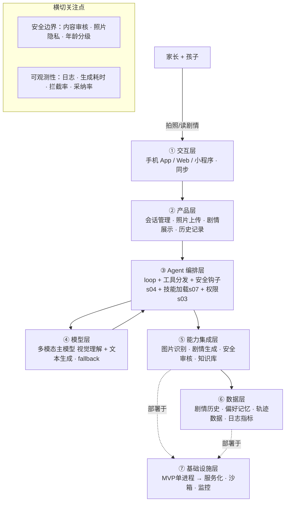

# PRD 推导方案 ——「玩具剧场」

> 状态：方案待确认（Step 1–4 已完成，Step 5 代码生成需确认后启动）
> 需求来源：家长拍玩具照片 → 生成亲子剧情演绎脚本

---

## 产品定位（一句话）

**「玩具剧场」**：家长拍一张玩具合影 → AI 识别玩具 → 生成一份**可亲子共同演绎的互动剧情脚本**（角色、场景、分幕、家长引导话术），让旧玩具翻新，也帮家长读懂孩子、一起玩。

---

## Step 1 · 需求拆解（提取硬事实）

| 维度 | 结论 | 状态 |
|---|---|---|
| 目标 | 把"玩腻的玩具"通过剧情演绎重新激活，家长孩子一起玩 | 基本明确 |
| 用户 | 直接用户=家长（拍照/读脚本/引导）；体验者=孩子 | 明确 |
| 核心闭环 | 拍照 → 识别玩具 → 生成剧情脚本 → 亲子共同演绎 | 明确 |
| 交付物 | 一份剧情演绎脚本（角色分配 + 场景搭建 + 分幕 + 对话 + 家长引导话术） | 明确 |
| 边界 | 绝不生成暴力/恐怖/成人/危险模仿内容；照片隐私 | 明确（红线） |
| 约束 | 孩子年龄段、时延要求、交互形态、照片是否上云 | **待确认** |

---

## Step 2 · 领域建模（映射 Harness 五要素）

| 要素 | 内容 |
|---|---|
| **工具** | `analyze_photo`（识别照片玩具）、`generate_story`（生成剧情）、`safety_check`（内容安全审核）、`save_story`（保存，可选） |
| **知识** | ①儿童适龄内容规范（年龄分级/安全红线/语言风格）②玩具剧情范式库（火车/积木/恐龙/玩偶…各自的桥段与玩法） |
| **观察** | 玩具识别结果（名称/数量/置信度）、内容安全审核结果、生成耗时、家长是否采纳 |
| **行动** | 输出结构化剧情脚本（文本渲染给家长）、（可选）导出/保存 |
| **权限** | 照片仅本次生成用、默认不持久化；生成内容必须过适龄审核 |

---

## Step 3 · 组件选型（宁可少选）

| 组件 | 选否 | 理由 |
|---|---|---|
| s01 Agent Loop | ✅ 必选 | 一切基础 |
| s02 工具系统 | ✅ 必选 | 识别/生成/审核都靠工具 |
| s03 权限系统 | ✅ 必选 | **儿童内容安全红线** + 照片隐私 |
| s04 钩子系统 | ✅ 必选 | 生成后自动挂"安全审核"钩子，不污染主循环 |
| s07 技能加载 | ✅ 必选 | 适龄规范 + 玩具范式库按需注入 |
| s15 集成 Harness | ✅ 必选 | 上述机制归一循环 |
| s09 记忆系统 | ⏸ 二期 | 记住孩子年龄/偏好玩具 → 个性化（MVP 可先不做） |
| s17 目标闭环 | ⏸ 二期 | "剧情算不算合格"自动判断 |
| s06/s08/s10~s14/s16 | ❌ 放弃 | 单次短会话、无并行、无定时、无多团队 |

---

## Step 4 · 架构设计

### 分层架构图（7 层 + 数据流）



**贯穿各层的数据流**：家长拍照 → ①上传 → ②建会话 → ③loop 调 `analyze_photo`（经 ④ 视觉理解）→ 得玩具清单 → 注入 s07 知识调 `generate_story`（经 ④ 生成）→ s04 钩子触发 `safety_check` 审核 → 通过后返回剧情 → ②渲染 → ①家长带孩子演绎；全程日志/轨迹写入 ⑥。

### 工具清单

| 工具 | 输入 | 输出 | 副作用 | 权限 | 归属层 |
|---|---|---|---|---|---|
| `analyze_photo` | 照片 | 玩具清单（名称/数量/特征/置信度） | 无 | allow | ⑤ |
| `generate_story` | 玩具清单 + 年龄 + 偏好 | 剧情脚本（角色/场景/分幕/对话/引导话术） | 无 | allow（须过审核） | ⑤ |
| `safety_check` | 生成内容 | 通过/拦截/需修改 + 理由 | 无 | allow | ③（钩子） |
| `save_story` | 剧情 | 存储确认 | 写存储 | ask | ⑥ |

### 系统提示词草案

```
你是「玩具剧场」的剧情导演兼编剧，为 3-10 岁儿童和家长设计亲子剧情演绎。

规则：
1. 安全第一：不出现暴力/恐怖/血腥/危险模仿（玩火、爬高、触电）/成人话题。
2. 年龄适配：按孩子年龄调整语言与深度，低龄用短句+重复，大龄可加选择分支。
3. 家长参与：每幕必须给"家长引导话术"，告诉家长怎么带孩子进入角色。
4. 具体可演：落到"用眼前这几个玩具怎么演"，给出场景搭建与动作建议。
5. 正向价值观：传递合作、勇气、分享、好奇心。

工具：analyze_photo、generate_story、safety_check
知识目录：child-safe-content（适龄规范）、toy-story-patterns（玩具剧情范式）
```

### 安全边界与降级策略

- **照片隐私**：默认不持久化照片，仅本次生成使用；保存需家长明确同意
- **内容安全**：生成后强制 `safety_check`；不过审自动重写 ≤3 次，仍失败降级为保守模板剧情
- **识别失败**：玩具识别不清 → 请家长一句话补充"照片里有哪些玩具"，或按通用类型生成
- **模型失败**：超时/报错 → 返回按玩具类型的"万用剧情模板"

### 可观测性

- 日志：每步耗时、工具调用、审核拦截记录
- 指标：生成成功率、平均首字延迟、安全拦截率、家长重生成率
- 轨迹：JSONL 记录（未来微调"儿童剧情"专用模型的原料）

### 技术栈与部署形态

- **MVP**：单进程 Python，复用 `scaffold/agent.py` 骨架 + s04 钩子 + s07 技能；交互先用 CLI 或极简 Web 传图
- **模型**：多模态（视觉 + 文本），Anthropic 或 `.env` 里的兼容提供商

---

## 待确认清单（8 问，答不上就是风险点）

1. **孩子年龄段**：3-6 / 6-12 / 全龄？（决定内容分级和语言难度）
2. **交互形态**：微信小程序 / 手机 App / 网页 / 先做 CLI 原型验证？
3. **照片隐私**：照片只本次使用不上云，还是要保存生成记录？
4. **剧情形式**：一次性完整脚本，还是**分幕递进 + 互动分支**（孩子选走向）？
5. **是否需要语音**：把剧情"念出来"给孩子听？（很多家长需要）
6. **领域知识从哪来**：适龄规范和玩具范式库由我内置，还是你有现成资料？
7. **失败怎么办**：上面降级策略是否符合预期？
8. **怎么算成功**：家长采纳率 / 生成速度 / 孩子玩得久？有无可量化指标？

---

## 下一步

回答上面 8 个问题（尤其是 1、2、4），据此修订方案后，进入 **Step 5 代码生成**（骨架 → 硬化 → 产品化）。
