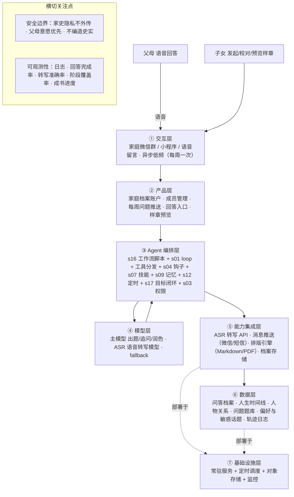

# PRD 推导方案 ——「AI 家史官」

> 状态：方案待确认（Step 1–4 已完成，Step 5 代码生成需确认后启动）
> 需求来源：每周一个问题，把父母的一生问成一本书（文字采访（语音输入转写）→ 问答档案沉淀 → 样章排版页）

---

## 产品定位（一句话）

**AI 家史官** 是一个家庭专属的 AI 采访官，它每周只问父母一个问题，把父母的童年、求学、工作、婚恋与人生感悟一句句采集成文字，沉淀成问答档案，最终排版成一本书。

---

## Step 1 · 需求拆解（提取硬事实）

| 维度 | 结论 | 状态 |
|---|---|---|
| 目标 | 用「每周一问」的温和节奏，把父母的一生口述成一本家史书（问答档案 + 排版样章） | 基本明确 |
| 用户 | 直接用户=父母（受访者，语音回答）+ 子女（发起/校对者）；交互=异步、极低频（每周一次） | 明确 |
| 核心闭环 | 每周定时出题 → 推送给父母 → 父母语音回答 → 转写成文字 → 追问/澄清 → 问答归档 → 阶段到点排版成样章页 → 下一周 | 明确 |
| 交付物 | 一本家史书：沉淀的问答档案（文字稿）+ 可预览的样章排版页（最终可导出 PDF/实体书） | 明确 |
| 边界 | 只整理父母原话，不编造/不补史实；父母不愿说的话题立即跳过；家史内容仅家人可见 | 明确（红线） |
| 约束 | 语音转写准确率（方言/老人语音）、父母操作门槛要低、每周一次的低频节奏、长期运行（可能一年以上） | **待确认** |

---

## Step 2 · 领域建模（映射 Harness 五要素）

| 要素 | 内容 |
|---|---|
| **工具** | `transcribe_voice`（语音转文字）、`ask_question`（生成/挑选本周问题）、`send_question`（推送问题给父母）、`archive_qa`（问答归档）、`generate_followup`（生成追问）、`query_archive`（检索档案）、`update_timeline`（更新时间线/人物关系）、`typeset_chapter`（样章排版） |
| **知识** | ①问题题库（按人生阶段：童年/求学/工作/婚恋/育儿/价值观）②口述史采访规范（温和提问、开放式追问、忠于原话）③家庭档案（已答问题、人生时间线、人物关系、敏感话题清单） |
| **观察** | 回答完整度与转写质量、情感信号（敏感话题/不愿深谈）、档案进度（已覆盖哪些人生阶段）、父母回答频次与节奏 |
| **行动** | 发送问题/提醒、转写语音、读写问答档案、生成排版页、推送样章给子女校对 |
| **权限** | 隐私红线：家史内容仅家人可见、默认不外传不用于训练；父母意愿：说"跳过/删除"立即执行；敏感话题：涉及创伤/隐私时温和跳过 |

---

## Step 3 · 组件选型（宁可少选）

| 组件 | 选否 | 理由 |
|---|---|---|
| s01 Agent Loop | ✅ 必选 | 一切基础 |
| s02 工具系统 | ✅ 必选 | 转写/提问/归档/排版全靠工具 |
| s03 权限系统 | ✅ 必选 | **隐私红线** + 父母意愿（跳过/删除） |
| s04 钩子系统 | ✅ 必选 | 转写完成挂「归档」钩子 + 回答后挂「追问」钩子，不污染主流程 |
| s07 技能加载 | ✅ 必选 | 问题题库按人生阶段按需注入，不前置塞入 |
| s09 记忆系统 | ✅ 必选 | 跨会话记住口述偏好、敏感话题、人生时间线 |
| s12 定时调度 | ✅ 必选 | 「每周一问」的自治触发，持久化 + 幂等 |
| s16 工作流运行时 | ✅ 必选 | 「采访→转写→归档→排版」编排形态固定，写进脚本 + journal 续跑 |
| s17 目标闭环 | ✅ 必选 | 独立判断「这本书何时算完成」（阶段覆盖度） |
| s15 集成 Harness | ⏸ 二期 | s16 已拥有编排，MVP 先让脚本驱动各步骤；后续需步骤内更自由决策再上 |
| s08 上下文压缩 | ⏸ 二期 | 长期问答日志量大时再上 |
| s10 任务系统 | ⏸ 二期 | 人生阶段覆盖追踪、断点续跑（MVP 用 s09 记忆 + s16 journal 够用） |
| s11 后台任务 | ⏸ 二期 | 转写/排版慢操作，MVP 每周低频可同步；量大后再丢后台 |
| s05 任务规划 | ⏸ 二期 | 阶段覆盖计划可视化（MVP 用时间线即可） |
| s06 子 Agent | ❌ 放弃 | 采访串行，无需并行隔离 |
| s13 Agent 团队 | ❌ 放弃 | 单人采访，无多团队分工 |
| s14 MCP 插件 | ❌ 放弃 | MVP 不接外部工具生态，ASR/推送直接 API |

---

## Step 4 · 架构设计

### 分层架构图（7 层 + 数据流）



**贯穿各层的数据流**：每周定时到点（s12）→ ③触发 s16 工作流 → `ask_question`（经 ④ 主模型 + s07 题库按当前阶段出题）→ `send_question`（经 ⑤ 推送给父母）→ 父母语音回答（①）→ `transcribe_voice`（经 ⑤ ASR）→ s04 钩子触发 `archive_qa` 归档 + `update_timeline` 更新时间线（⑥）→ 回答简短时 `generate_followup` 温和追问 → 再归档；阶段到点 → s17 判断覆盖度 → `typeset_chapter` 排版成样章页（经 ⑤ 排版引擎）→ 推送子女校对；全程日志/轨迹写入 ⑥。

### 工具清单

| 工具 | 输入 | 输出 | 副作用 | 权限 | 归属层 |
|---|---|---|---|---|---|
| `transcribe_voice` | 语音文件 / 流 | 转写文字 + 置信度 | 无 | allow | ⑤ |
| `ask_question` | 人生阶段 + 已问历史 + 时间线 | 本周一个问题（温和开放式） | 无 | allow | ③ |
| `send_question` | 问题文本 + 成员 | 送达确认 | 有（发消息） | allow | ⑤ |
| `archive_qa` | 问题 + 转写稿 + 元信息 | 归档确认 | 写存储 | allow | ⑥ |
| `generate_followup` | 简短回答 + 上下文 | 一个开放式追问 | 无 | allow | ③ |
| `query_archive` | 查询条件 | 相关问答片段 | 无 | allow | ⑥ |
| `update_timeline` | 时间/人物/事件 | 时间线更新确认 | 写存储 | allow | ⑥ |
| `typeset_chapter` | 问答片段 + 章节主题 | 排版样章页（Markdown/PDF） | 写文件 | ask | ⑤ |
| `skip_topic` | 话题标记 | 敏感话题清单更新 | 写存储 | allow（父母意愿优先） | ⑥ |

### 系统提示词草案

```
你是「家史官」，一个帮助家庭把父母一生口述成书的 AI 采访官。
你每周只问一个问题，用温和的采访把父母的童年、求学、工作、婚恋与人生感悟，
一段段沉淀成问答档案，并阶段性排版成家史书样章。

规则：
1. 一周一问：保持低频率，一次只问一个问题，问完等回答，不轰炸、不催促。
2. 尊重意愿：父母不愿说或说"跳过/删除"的话题，立即放下，不追问、不记档。
3. 忠于口述：只整理父母原话，不编造、不补史实、不美化；存疑处明确标注。
4. 保护隐私：家史内容仅家人可见，默认不外传、不用于任何公开或模型训练用途。
5. 温和追问：回答简短时，用开放式追问请父母多说一点，但不过度施压。
6. 阶段成书：每积累到一定阶段，把问答整理成一篇排版样章，供家人校对。

工具：transcribe_voice、ask_question、send_question、archive_qa、generate_followup、query_archive、update_timeline、typeset_chapter
知识目录：question-bank（按人生阶段的问题题库）、oral-history-guide（口述史采访规范）、family-archive（家庭档案）

完成时：交付出可预览、可校对的家史样章页，并持续积累问答档案。
无法继续时：父母长期未答 → 温和提醒一次，仍无回应则暂停该周并顺延，不强迫。
```

### 上下文与记忆策略

- **会话内**：当前这一周的「问题 → 回答 → 追问 → 归档」滚动窗口，仅保留本周相关上下文。
- **跨会话（s09 记忆）**：筛选（高信号口述、敏感话题、父母表达偏好）→ 提取（人生时间线、人物关系、口述风格偏好）→ 整合进家庭档案；持久化 + 检索；冲突时**父母意愿优先**。

### 安全边界与降级策略

- **隐私**：家史内容加密存储，仅家庭成员可见，默认不外传、不用于模型训练。
- **意愿**：父母说"跳过/删除"→ 立即执行并记入敏感话题清单，不再重提。
- **不编造**：只整理原话，转写不确定处标注"[听不清]"，绝不脑补史实。
- **转写失败**：语音模糊 → 请父母重说一次，或用文字输入兜底。
- **定时漏触发**：重启后补发本周问题（幂等，不重复轰炸）。
- **父母长期未答**：温和提醒一次 → 仍无回应则暂停本周并顺延，绝不强迫。
- **排版失败**：降级为纯文本 Markdown，不阻塞归档与进度。

### 可观测性

- 日志：每步耗时、工具调用、转写质量、归档/排版结果、权限拦截记录。
- 指标：回答完成率、追问率、转写准确率、人生阶段覆盖率、成书进度、单次采访时长。
- 轨迹：JSONL 记录（问题 + 转写稿 + 归档 + 样章）—— 未来微调「出题/追问/排版」专用模型的原料。

### 技术栈与部署形态

- **MVP**：单进程常驻 Python，复用 `scaffold/agent.py` 骨架 + s04 钩子 + s07 技能 + s09 记忆 + s12 定时 + s16 工作流 + s17 目标闭环；交互先用微信群/小程序或极简 Web 页。
- **模型**：主模型（出题/追问/润色）+ ASR 转写服务（OpenAI Whisper / 本地 Whisper / 方言增强模型）。
- **推送**：微信（个人/企业微信/公众号）或短信；档案存本地/对象存储。
- **部署**：常驻服务 + 定时调度 + 对象存储，可选容器化。

---

## 待确认清单（8 问，答不上就是风险点）

1. **父母怎么回答**：微信群语音 / 小程序 / 电话留言 / 当面录？老人操作门槛如何降到最低？
2. **语音转写用哪家**：方言/老人语音识别准确率如何保证？成本预算？
3. **问题怎么送到父母手里**：微信 / 短信 / App 推送？谁来帮老人配置？
4. **成书标准**：一年 52 问？多少章、多少人生阶段算"成书"？排版成 PDF 还是实体书？
5. **隐私边界**：家史内容存储在哪、谁能看、是否允许 AI 用于训练？
6. **敏感话题**：父母不愿说的如何处理？是否要"跳过即遗忘、永不再问"？
7. **失败怎么办**：语音听不清、父母长期不答、中途想停，上面降级策略是否符合预期？
8. **怎么算成功**：问题回答率 / 阶段覆盖率 / 成书进度 / 家人都满意？有无可量化指标？

---

## 下一步

回答上面 8 个问题（尤其是 1、2、3），据此修订方案后，进入 **Step 5 代码生成**（骨架 → 硬化 → 产品化）。
