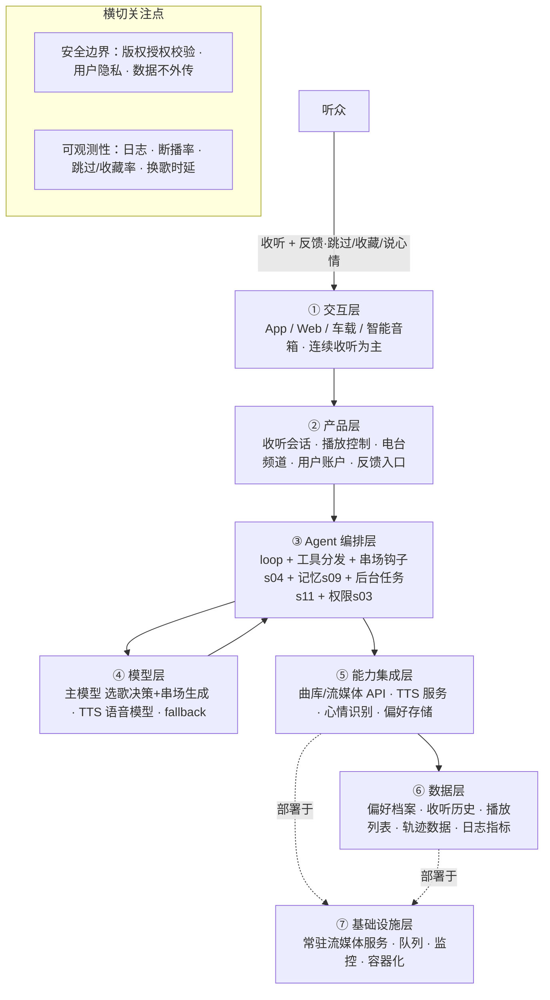

# PRD 推导方案 ——「WaveDJ」

> 状态：方案待确认（Step 1–4 已完成，Step 5 代码生成需确认后启动）
> 需求来源：AI 电台主持人，懂口味与心情，自动选歌 + 歌间串场，永远在线，越听越懂你

---

## 产品定位（一句话）

**WaveDJ** 是一个 AI 电台主持人，它懂你的音乐口味和心情，会自动选歌、在歌与歌之间说话串场，就像有一档只属于你的电台节目，永远在线，越听越懂你。

---

## Step 1 · 需求拆解（提取硬事实）

| 维度 | 结论 | 状态 |
|---|---|---|
| 目标 | 提供一档「只属于你」的连续电台节目：按口味+心情自动选歌，歌间人声串场，越听越懂你 | 基本明确 |
| 用户 | 直接用户=音乐听众（个人）；交互=连续收听为主，异步穿插反馈（跳过/收藏/说心情） | 明确 |
| 核心闭环 | 进入电台 → 感知口味/心情 → 选歌 → 播放 → 歌间串场 → 用户反馈 → 更新偏好 → 接下一首 | 明确 |
| 交付物 | 一段连续音频流（歌曲 + 主持串场）+ 可回溯的播放列表 | 明确 |
| 边界 | 只播已授权曲目（版权红线）；串场不输出用户隐私/第三方个人信息 | 明确（红线） |
| 约束 | 音乐来源与版权、TTS 音色与成本、心情感知方式、串场时延、「永远在线」的交互形态 | **待确认** |

---

## Step 2 · 领域建模（映射 Harness 五要素）

| 要素 | 内容 |
|---|---|
| **工具** | `get_mood`（感知心情）、`search_music`（按口味+心情查曲库）、`select_song`（定下一首）、`generate_segue`（生成串场词）、`tts_speak`（合成语音）、`play_audio`（播放）、`record_feedback`（记录跳过/收藏/情绪）、`update_profile`（更新偏好） |
| **知识** | ①曲库元数据（歌名/艺人/曲风/BPM/情绪标签/版权授权状态）②DJ 串场范式库（开场/转场/报歌名/呼应心情与时间）③用户偏好档案（口味、历史、跳过/收藏） |
| **观察** | 播放行为（跳过/听完/收藏/音量）、心情输入（文字/语音/情绪标签）、串场生成与 TTS 结果、切歌时机与连续性 |
| **行动** | 调用曲库/流媒体 API 取歌、播放音频流、TTS 合成输出语音、读写用户偏好存储 |
| **权限** | 版权红线：只播授权曲目；用户数据：偏好/历史仅本人可见、默认不外传；付费/订阅操作需确认 |

---

## Step 3 · 组件选型（宁可少选）

| 组件 | 选否 | 理由 |
|---|---|---|
| s01 Agent Loop | ✅ 必选 | 一切基础 |
| s02 工具系统 | ✅ 必选 | 选歌/串场/TTS/播放/反馈都靠工具 |
| s03 权限系统 | ✅ 必选 | **版权红线** + 用户隐私边界 |
| s04 钩子系统 | ✅ 必选 | 歌结束自动挂「串场生成」钩子 + 播放行为埋点，不污染主循环 |
| s09 记忆系统 | ✅ 必选 | 「越听越懂你」= 跨会话记住口味/心情/反馈 |
| s11 后台任务 | ✅ 必选 | 播这首时后台预取下一首+串场，保证**不断播** |
| s15 集成 Harness | ✅ 必选 | 多机制归一循环 |
| s07 技能加载 | ⏸ 二期 | 串场范式库庞大时按需注入（MVP 先内置提示词） |
| s08 上下文压缩 | ⏸ 二期 | 长期收听日志量大时再上 |
| s12 定时调度 | ⏸ 二期 | 「定时节目/闹钟」等自治触发（MVP 是打开就连播） |
| s14 MCP 插件 | ⏸ 二期 | 接 Spotify/Apple Music 等外部音乐生态时再上 |
| s16 工作流运行时 | ⏸ 二期 | 电台编排形状较固定，可固化成脚本（MVP 先让模型自主） |
| s17 目标闭环 | ⏸ 二期 | 「这档节目是否满意」的自动判断 |
| s06 子 Agent | ⏸ 二期 | 选歌+串场可并行加速（MVP 串行即可） |
| s05/s10/s13 | ❌ 放弃 | 电台是连续流，非多步骤目标、无任务拆解、无多团队 |

---

## Step 4 · 架构设计

### 分层架构图（7 层 + 数据流）



**贯穿各层的数据流**：听众进入电台/表达心情 → ① → ②建收听会话 → ③loop 读记忆(s09)得口味档案 → 调 `get_mood` + `search_music`（经 ⑤ 曲库）→ `select_song` 定歌 → `play_audio` 播放 → s04 钩子触发 `generate_segue`（经 ④ 生成串场词）→ `tts_speak`（⑤）→ 播串场接下一首；期间 s11 后台预取「下一首+串场」，保证歌播完就有接档；听众反馈 → `record_feedback` → s09 更新偏好；全程日志/轨迹写入 ⑥。

### 工具清单

| 工具 | 输入 | 输出 | 副作用 | 权限 | 归属层 |
|---|---|---|---|---|---|
| `get_mood` | 文字/语音/播放行为 | 心情标签 + 置信度 | 无 | allow | ⑤ |
| `search_music` | 口味 + 心情 + 上下文 | 候选曲目列表（含授权状态） | 无 | allow（仅授权曲库） | ⑤ |
| `select_song` | 候选 + 历史 + 偏好 | 下一首曲目 | 无 | allow | ③ |
| `generate_segue` | 上一首/下一首 + 心情 + 时间 | 串场词文本（1-3 句） | 无 | allow | ③ |
| `tts_speak` | 文本 | 语音音频 | 无 | allow | ⑤ |
| `play_audio` | 曲目/音频 | 播放状态 | 有（播放） | allow | ⑤ |
| `record_feedback` | 事件（跳过/收藏/情绪） | 记忆更新确认 | 写存储 | allow | ⑥ |
| `update_profile` | 偏好变更 | 确认 | 写存储 | ask | ⑥ |

### 系统提示词草案

```
你是 WaveDJ，用户专属的 AI 电台主持人。你为用户编排一档连续的电台节目：
根据 TA 的音乐口味和此刻心情自动选歌，并在歌与歌之间用人声串场，
让节目像「只属于 TA 的电台」，永远在线，越听越懂 TA。

规则：
1. 版权红线：只播放曲库中已授权的曲目，不虚构、不播放未授权内容。
2. 口味优先：选歌以用户口味档案与历史反馈为准，冲突时以用户当下指令优先。
3. 串场自然：每首歌之间说 1-3 句串场，报歌名/艺人、呼应心情与时间，不剧透、不啰嗦。
4. 越听越懂：记录跳过/收藏/情绪反馈，持续更新用户偏好。
5. 隐私边界：偏好与收听历史仅用户本人可见，不输出第三方个人信息。

工具：get_mood、search_music、select_song、generate_segue、tts_speak、play_audio、record_feedback
知识目录：music-catalog（曲库元数据）、dj-segue-patterns（串场范式）、user-profile（偏好档案）

完成时：交付一段连续的音频流（歌曲 + 串场），并保持不间断接档。
无法继续时：曲库无匹配或模型失败 → 回退到安全歌单继续播，绝不「断播」。
```

### 上下文与记忆策略

- **会话内**：当前收听会话保留「已播曲目 + 串场记录 + 实时心情」，滚动窗口，播过的歌不入下一次选歌。
- **跨会话（s09 记忆）**：筛选（跳过/收藏/情绪高信号）→ 提取（口味标签、艺人/曲风偏好、时段情绪规律）→ 整合进偏好档案；持久化 + 检索；冲突时用户当下指令优先。

### 安全边界与降级策略

- **版权**：选歌结果强制过曲库授权校验，未授权曲目拒绝播放并重选。
- **用户数据**：偏好/历史仅本人账号可见，加密存储，默认不外传第三方。
- **选歌失败**：曲库无匹配 → 回退到用户历史高收藏曲目，或「安全歌单」通用曲目。
- **串场/TTS 失败**：串场词降级为文字展示或跳过串场直接接歌，不阻塞播放。
- **模型失败/超时**：用后台预取好的安全歌单继续播，保证**不断播**（永远在线）。
- **心情识别失败**：默认按最近一次心情 + 时段（早/午/晚）推断，或请用户一句话表达。

### 可观测性

- 日志：每步耗时、工具调用、选歌/串场结果、TTS 状态、权限拦截记录。
- 指标：连续播放时长（断播率）、跳过率、收藏率、串场采纳率、平均换歌时延、单档收听时长。
- 轨迹：JSONL 记录（歌单 + 串场词 + 用户反馈）—— 未来微调「选歌/串场」专用模型的原料。

### 技术栈与部署形态

- **MVP**：单进程常驻 Python，复用 `scaffold/agent.py` 骨架 + s04 钩子 + s09 记忆 + s11 后台任务；交互先用 CLI 或极简 Web 播放器。
- **模型**：主模型（选歌决策 + 串场词生成）+ TTS 服务（ElevenLabs / 本地 TTS）；音乐源接授权曲库/流媒体 API。
- **部署**：常驻流媒体服务，可选容器化 + 队列。

---

## 待确认清单（8 问，答不上就是风险点）

1. **音乐从哪来**：授权曲库 / Spotify / Apple Music / 自有曲库？版权与成本怎么处理？
2. **交互形态**：手机 App / 网页 / 车载 / 智能音箱，还是先做 CLI 原型验证？
3. **心情怎么感知**：用户主动说（文字/语音）、从播放行为推断，还是接情绪/健康数据？
4. **串场要真人感语音吗**：TTS 用哪家？要克隆专属声线吗？成本预算？
5. **永远在线的形态**：打开就连播，还是要支持定时节目/闹钟？
6. **越听越懂的范围**：只记音乐口味，还是也记生活信息（通勤/作息）来选歌？
7. **失败怎么办**：上面降级策略是否符合预期（尤其「断播」是否可接受）？
8. **怎么算成功**：收听时长 / 跳过率 / 收藏率 / 留存？有无可量化指标？

---

## 下一步

回答上面 8 个问题（尤其是 1、2、3），据此修订方案后，进入 **Step 5 代码生成**（骨架 → 硬化 → 产品化）。
