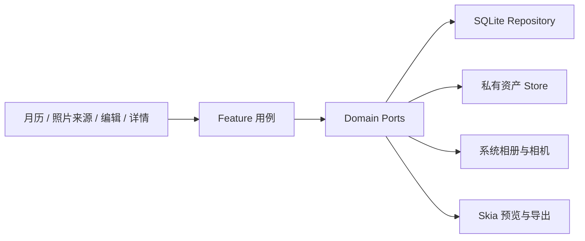
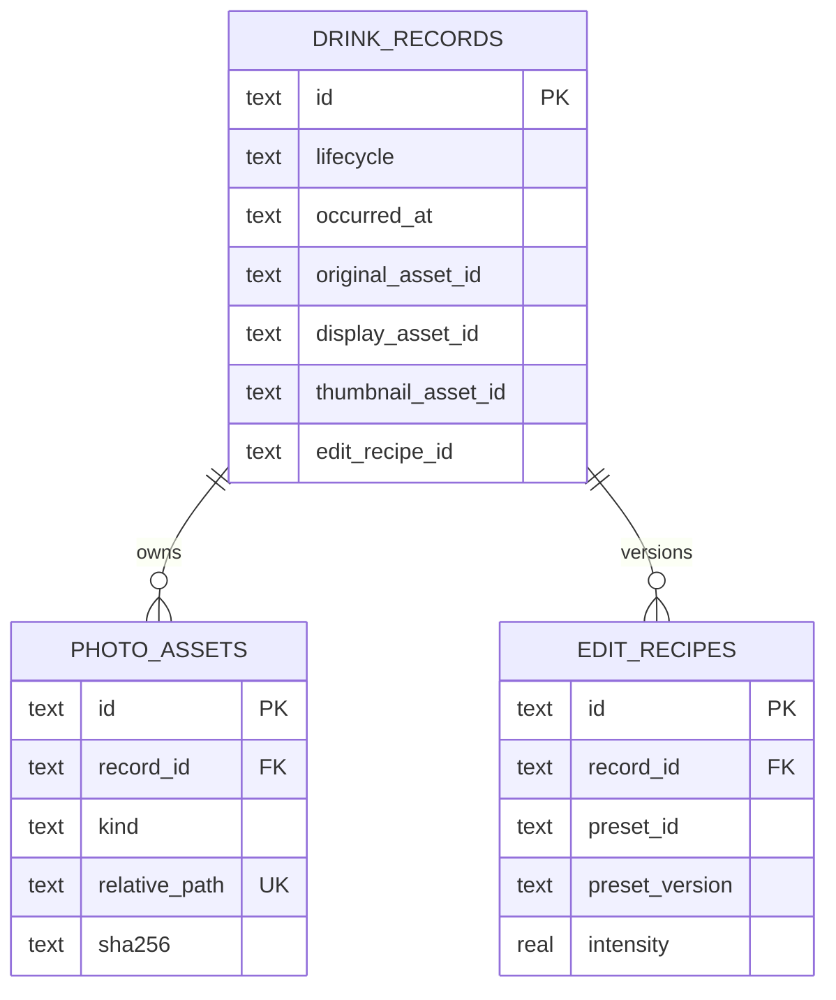

# 第一阶段架构与数据一致性

## 依赖边界

- 页面只认识领域对象和 Port，不执行 SQL、不持有绝对路径。
- 平台差异由原生依赖的自动链接层处理，业务状态和滤镜配方共用。
- Zod 同时校验 Picker 返回、数据库读取、资产路径和配方版本。

## SQLite Schema V1

`schema_migrations` 记录已应用版本。启动时启用 foreign keys 与 WAL；未知更高版本停止写入，不尝试破坏性降级。

## 保存时序

1. 导入照片后立即复制原图到私有目录并计算 SHA-256。
2. 在 SQLite 事务中创建 `draft` 记录和原图资产行。
3. 用户保存时用同一 Recipe 分别渲染详情派生图和 640px 缩略图。
4. 两个文件先写 `.partial`，校验后移动到最终路径。
5. 在一个 SQLite 事务中插入新 Recipe、新资产，并 UPSERT 同一 `recordId` 为 `saved`。
6. 可捕获的任一步失败都会保留原图与原草稿，并主动清理本次已生成但尚未被数据库引用的派生文件。

SQLite 和文件系统无法组成同一个跨介质事务，因此第 4–6 步是明确的补偿式一致性边界，而不是假装原子。如果进程恰好在最终文件移动后、数据库提交前被系统杀死，仍可能留下不可捕获的孤儿文件；启动扫描清理属于后续阶段。

## 失败补偿覆盖

- 创建草稿的数据库事务失败：删除刚复制到私有目录、且尚未被引用的原图。
- 滤镜详情图渲染或写入失败：删除本次已生成的详情派生图。
- 缩略图渲染、写入或数据库保存失败：删除本次详情派生图和缩略图。
- 补偿清理采用 best-effort；清理错误不能覆盖最初应呈现给用户的业务错误。
