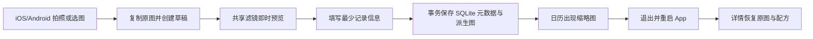
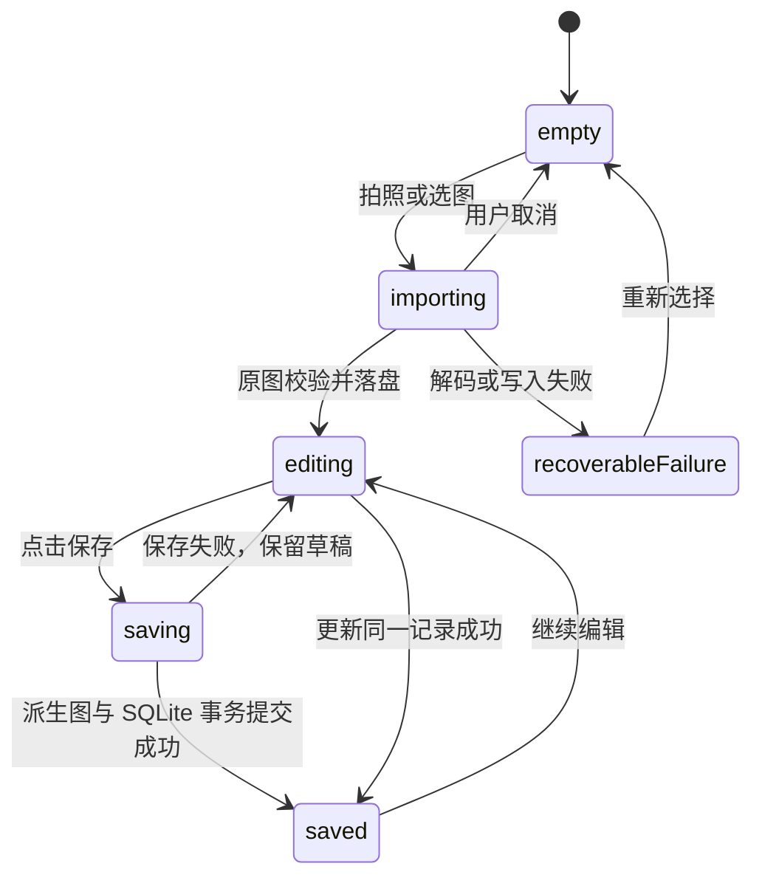

# AI 饮品生活日记｜第一阶段技术适配与开发声明

> 文档版本：V1.2（SQLite 实施版）  
> 编制日期：2026-09-02  
> 当前状态：方案已确认；第一阶段已开工  
> 本轮产品决定：iOS 尽可能广泛兼容，同时支持 Android  
> 配套文档：[PRD_AI饮品生活日记_V1.0.md](PRD_AI饮品生活日记_V1.0.md)、[通用技术栈手册](AI产品Vibe%20Coding通用技术栈手册(1)_副本3.md)、[通用前端技术栈手册](AI产品Vibe%20Coding通用前端技术栈手册_副本4.md)、[上线部署手册](AI%20Agent%20产品上线部署手册_副本.md)、[Agent Blueprint](agent-blueprint_副本2/BLUEPRINT.md)  
> 文档性质：合并《技术适配声明》《前端技术适配声明》与《第 1 阶段技术开发文档》，只约束第一阶段，不代表完整 P0 已交付

---

## 0. 开发结论

第一阶段改为 **React Native 双端纵向切片**，用一套 TypeScript 业务与界面代码，同时交付 iOS 和 Android：

> 拍照或选图 → 使用一款端侧免费滤镜 → 填写最少记录信息 → 保存 → 日历出现记录 → 退出并重启 App → 重新打开、查看原图并继续调整。

推荐技术组合：

> React Native Community CLI + TypeScript strict + React Native Skia + 系统相册/相机适配器 + 跨平台 SQLite + 两端私有文件目录。

本阶段不调用 AI 生图 API，不建设后端，不接会员，不接 StoreKit/Google Play Billing，不上传照片，不产生模型或云服务器费用。

### 0.1 “尽量所有 iOS 版本”的现实定义

“所有 iOS 版本”无法作为可实现承诺：早期 iOS 已经不能使用当前 Xcode、现代依赖和 App Store 提交流程，继续兼容会迫使项目锁在停止维护的框架上，反而增加安全和崩溃风险。

本项目采用“**当前受维护框架能覆盖的最老系统**”作为兼容策略：

| 平台 | 第一阶段支持下限 | 说明 |
|---|---:|---|
| iOS | **iOS 15.1+** | 当前 React Native 官方仓库说明可面向 iOS 15.1 及以上；不使用 SwiftData、`@Observable` 等 iOS 17 专属能力 |
| Android | **Android 7.0+（API 24）** | 当前 React Native 官方仓库说明可面向 Android 7.0/API 24 及以上 |
| iPad/Android 平板 | 可安装但不做专项布局承诺 | 第一阶段验收设备是手机；平板专项适配后置 |

依据：[React Native 官方仓库的当前平台要求](https://github.com/facebook/react-native)、[React Native 0.87 发布说明](https://reactnative.dev/blog/2026/08/11/react-native-0.87)。

低于 iOS 15.1 或 Android 7.0 的设备不进入第一阶段支持范围。若未来真实用户数据证明存在足够大的旧系统群体，再单独评估旧版客户端；不在主代码库内长期维护两个框架版本。

### 0.2 兼容不等于所有设备同等性能

第一阶段将兼容分成两级：

- **功能兼容级：**iOS 15.1–16.x、Android 7–9。主链路必须可用、数据不丢、不能崩溃；允许预览分辨率更低、高清派生图生成更慢。
- **体验基准级：**iOS 17+、Android 10+ 且内存不少于 4GB。滤镜滑动、导入和保存按主要性能目标验收。

核心记录能力、隐私边界和原图保护不得因系统较旧而取消。只有预览尺寸、缓存大小、动画和后台并发可以按设备能力降级。

### 0.3 第一阶段解决的用户、需求和痛点

| 用户与场景 | 当前痛点 | 本阶段满足的需求 | 本阶段产品回应 |
|---|---|---|---|
| 通勤途中快速拍咖啡的文艺生活记录者 | 时间短，拍完后照片很快淹没在系统相册里 | 快速完成最低信息量记录 | 自动日期、少量选填字段、一键保存 |
| 在咖啡馆独处、希望保留当日情绪的用户 | 普通记录像填表，缺少即时审美回报 | 不离开记录流程就能获得稳定氛围 | 一款精选免费滤镜、即时预览、原图对比 |
| 使用不同品牌手机的奶茶/咖啡爱好者 | 不希望产品只服务新款 iPhone | 在常见 iPhone 与 Android 手机上完成相同核心任务 | 一套产品逻辑、同一配方、双端一致验收 |
| 对 AI 艺术化感兴趣但尚未付费的用户 | 免费基础体验不完整就难形成记录习惯 | 即使不用 AI 也能长期记录 | 全链路免费、离线可用，不设置会员拦截 |

### 0.4 本阶段与 P0 的关系

PRD 的 P0 是完整首发范围，包含六款免费滤镜、排版、AI 推荐、四个艺术 Skill、会员、日历和个人页；第一阶段只是其中的 **免费记录纵向切片**。只做一款滤镜且不做 AI，是按照 PRD 第 27 节缩小验证面，不是取消完整 P0。

PRD 原文把“iOS 优先、Android 是否同期”标为待确认；本轮产品指令已明确 Android 也要支持。按资料优先级，本轮明确指令覆盖 PRD 中的旧待确认项。后续应在下一版 PRD 同步这一决定。

---

# 第一部分：技术适配声明

## 1. 产品形态判断

- **产品类型与核心任务：**本地优先的饮品照片生活日记，后续扩展为带 AI 艺术化能力的订阅产品。
- **核心交互：**第一阶段不是一次生成或对话 Agent，而是拍照/选图、可视化调节、保存和日历回看的连续交互。
- **开发路径：**纵向切片。照片导入、端侧滤镜、双端真实交互和本地恢复共同决定产品是否可用。
- **主要终端：**iOS 手机 + Android 手机，同一阶段交付。
- **当前阶段范围：**双端 App 骨架、系统拍照/选图、一个合并式记录编辑页、一款免费滤镜“奶油晨光”、非破坏性参数保存、月历、记录详情与重启恢复。
- **当前阶段性质：**工程可行性与核心体验验证版本，不是 App Store/Google Play 发布版，也不代表 P0 全部完成。

## 2. 采用的默认方案

- **React Native + TypeScript strict：**采用通用手册的手机端默认方案，用一套业务/UI 代码覆盖 iOS 和 Android。
- **Git：**采用。正式编码时在新建的移动端项目目录初始化，保留回滚和审查能力。
- **运行时结构校验：**采用。TypeScript 只负责编译期类型；SQLite 读出的领域对象与 Edit Recipe 还要经过 Zod 运行时 Schema 校验。
- **系统能力适配层：**采用。相机、相册、文件路径和权限通过统一接口接入，页面不直接判断平台。
- **图片与元数据分离：**采用。图片进入两端 App 私有文件目录；SQLite 只保存元数据、相对路径和关联。
- **非破坏性编辑：**采用。原图不可覆盖，滤镜效果由版本化配方重建，派生图是新资产。
- **自动化与双端真机测试：**采用。共享逻辑、组件、原生适配器和双端主链路分别验证。
- **统一错误边界：**采用。用户看到可理解的恢复动作；日志不展示照片内容、用户文字、堆栈和绝对路径。

## 3. 触发的按需模块

| 模块 | 触发需求 | 本阶段处理 |
|---|---|---|
| React Native Skia | 同一滤镜配方要在 iOS/Android 实时预览并尽量一致 | 引入；共享色彩管线与离屏渲染 |
| 系统照片/相机适配器 | 双端都要拍照和选择单张静态图 | 引入；优先系统选择器，按使用时申请权限 |
| 本地资产适配器 | React Native 核心没有满足本项目复制、校验值和私有目录的完整接口 | 通过受维护的跨端文件库实现，并封装为 `LocalAssetStore`；只承担文件原语，不复制业务规则 |
| 跨平台 SQLite | 记录需要按月份查询、同记录更新、草稿恢复和后续平滑迁移 | 引入 OP-SQLite；迁移版本受控，记录、资产与配方在同一事务提交 |
| React Navigation | 月历、编辑、详情之间需要稳定导航与返回行为 | 引入最小 Native Stack |
| 持久化草稿 | 保存失败或进程中断后不能清空内容 | 引入最小 `draft/saved` 生命周期 |

React Native Skia 官方当前要求 React Native 0.79+，并支持 iOS 14+/Android API 21+，低于本项目 React Native 自身的系统下限，因此不会额外缩小本项目的 iOS 15.1/Android 7 覆盖范围。[官方安装说明](https://shopify.github.io/react-native-skia/docs/getting-started/installation/)

本阶段不触发服务端数据库、对象存储、任务队列、SSE、模型 SDK、RAG、OCR、StoreKit、Google Play Billing 或第三方分析 SDK。

## 4. 偏离或暂缓的默认方案

| 默认项/旧方案 | 第一阶段替代方案 | 原因 | 影响 | 重新评估条件 |
|---|---|---|---|---|
| 旧声明：SwiftUI 原生单端 | React Native Community CLI 双端 | 用户已明确 Android 同期；需要尽量扩大 iOS 版本覆盖 | 少量文件/权限原语要分别写 iOS 与 Android 适配器，但业务、页面、配方共用 | 仅当跨端渲染可行性验证失败才重新评估 |
| 旧声明：iOS 17 + SwiftData | iOS 15.1+/Android 7+ + OP-SQLite | SwiftData 把最低系统锁在 iOS 17，Android 无法复用；JSON 清单不适合作为真实产品的数据基础 | 增加一项原生依赖，但获得事务、索引和显式迁移 | 账号与云同步进入范围时再评估服务端数据库与同步模型 |
| 最新 Expo SDK | 不采用 Expo Managed/CNG；使用 Community CLI | 当前 Expo 最新版支持下限为 iOS 16.4，会减少旧 iPhone 覆盖；本项目还需自定义原生资产原语 | 环境配置比 Expo 多，需要 Xcode、Android Studio、CocoaPods/Gradle | 若未来 Expo 的维护版本下限与能力同时满足要求再评估 |
| 原生 Core Image | React Native Skia 共享滤镜管线 | 避免 iOS/Android 各写一套滤镜导致审美漂移 | 增加约 6MB iOS、4MB Android 的官方估算包体开销；需验证旧机内存 | Skia 无法完成目标图像质量或导出性能时局部增加原生渲染适配 |
| 手册 Agent MVP 默认 Python + FastAPI | 本阶段不建后端 | 第一阶段没有 AI、账户、计费或跨用户动作 | 无云同步和跨设备恢复；没有服务器费用 | 第二阶段接 AI 会员、任务和账本时引入 |
| PRD 阶段 1 的“本地/云端持久化” | 推荐只做可靠本地持久化 | 云同步会提前引入账号、冲突、网络失败和隐私范围 | 卸载后不能恢复、不支持跨设备 | 产品明确第一阶段必须跨设备，或进入云同步专项 |
| PRD P0 六款滤镜 | 第一阶段只做“奶油晨光” | 先验证共享渲染、参数恢复、双端一致性和性能 | 不代表完整免费滤镜库 | 单滤镜双端通过后再扩展 |
| PRD P0 AI、会员与四个 Skill | 全部暂缓 | 本阶段不产生模型费用，先验证免费记录习惯 | 当前版本不是完整 AI 产品 | 第二阶段接一个可商用 Style 和双平台会员闭环 |

Expo 当前兼容信息来自[官方 SDK 版本表](https://docs.expo.dev/versions/latest/)；不采用 Expo 的结论是为兼容目标所做的项目适配，不代表 Expo 本身不可用。

## 5. 强制底线检查

| 检查项 | 当前结论 | 第一阶段落实方式 |
|---|---|---|
| 密钥与隐私 | 设计通过，待实现验证 | 无 API Key、无网络上传；只在用户触发相机时申请相机权限；相册优先系统选择器 |
| 数据可恢复 | 方案已定义，待双端重启测试 | SQLite 事务与迁移、私有资产目录、草稿持久化、孤儿资产清理 |
| 输入输出校验 | 方案已定义，待测试 | 校验图片真实类型、可解码性、像素、大小、配方版本、强度和文本长度 |
| 错误与日志 | 方案已定义，待测试 | 统一 `AppError`；不向用户显示原生堆栈、绝对路径或平台异常原文 |
| 兼容性真实性 | 方案已定义，待边界设备验证 | iOS 15.1 与 Android API 24 作为最低边界，另测两端当前稳定版 |
| 测试与真实模型 | 自动化与真机计划已定义 | Jest/组件测试/原生单测/E2E + iOS/Android 真机；本阶段无模型，真实模型冒烟为“不适用” |
| 删除与覆盖 | 设计通过 | 第一阶段不提供记录删除；更新生成新派生资产，原图始终保留 |

## 6. 需要产品经理决定的问题

“iOS 尽可能广泛兼容 + Android 同期支持”以及“第一阶段只保证本机重启恢复，云同步与跨设备恢复后置”均已由产品负责人在 2026-09-02 的开工指令确认，不再列为待确认。

若没有异议，以下非阻塞项直接采用推荐值：

- 支持下限为 iOS 15.1 和 Android 7.0/API 24，不维护更早系统专版。
- 开发期内部名称为 `DrinkDiary`；正式名称和商店标识发布前替换。
- 第一款滤镜为“奶油晨光”，用双端样片校准。
- 第一阶段支持简体中文和手机竖屏；平板、横屏和多语言后置。

---

# 第二部分：第 1 阶段技术开发文档｜双端免费记录纵向切片

## 一、阶段目标

### 1.1 交付范围

1. 创建可运行的 React Native iOS/Android 工程骨架。
2. 在两端使用系统相册选择一张照片，或调用系统相机拍一张照片。
3. 导入后复制原图到 App 私有目录，并创建可恢复草稿。
4. 使用同一份“奶油晨光”配方进行双端预览，支持 0–100 强度和按住查看原图。
5. 日期必填；饮品名、类别、店铺、城市、心情和一句话选填。
6. 保存完整滤镜配方、资产关联和适合详情展示的派生图。
7. 月历在对应日期显示缩略图，点击进入详情。
8. 两端强制退出并重启后，记录、原图、派生图与配方仍可读取。
9. 从详情继续编辑时恢复同一配方；再次保存更新原记录，不产生重复记录。
10. 在最低系统边界与当前主流系统各验证一遍核心流程。

### 1.2 阶段产物

- 一个包含 `ios/` 与 `android/` 原生工程的 React Native 项目。
- TypeScript strict 领域模型、运行时 Schema 与 SQLite Schema V1。
- iOS/Android 私有 Asset Store 跨端适配器。
- “奶油晨光”版本化共享滤镜配方与 Skia 渲染器。
- 月历、创建/编辑、详情三个最小产品界面。
- Jest、React Native Testing Library、iOS/Android 原生单测和双端 E2E。
- 兼容性矩阵、样片评审记录和双端真机验收记录。
- README：环境、启动、构建、测试、已知限制和数据位置。

### 1.3 先做技术探针，再铺业务

跨平台方案正式展开前，先完成一个不超过本阶段范围的可丢弃/可演进探针：

1. React Native 0.87 在本机成功构建 iOS 与 Android 空壳。
2. 同一张授权照片在两端完成 Skia 预览、强度变化和离屏编码。
3. 系统相册/相机返回的图片能复制进两端私有目录。
4. iOS 15.1 边界设备/模拟环境与 Android API 24 模拟器至少启动成功。
5. 两端结果经过感知差异检查，没有明显色偏、方向错误或裁切差异。

探针失败时先解决或局部替换适配器，不继续开发页面来掩盖基础技术风险。

### 1.4 主链路



### 1.5 明确不做

- 其余五款滤镜、完整裁剪/旋转/调色/颗粒/暗角工具。
- 免费排版、贴纸、系统相册导出、分享卡。
- AI 理解、AI 推荐、AI 艺术化和任何 Style Skill 调用。
- 后端、账户、登录、云同步、对象存储和网络上传。
- StoreKit、Google Play Billing、会员、赠送次数、额度账本和付费墙。
- 地图、定位、护照、印章、挑战、月度刊物、推送。
- Web、桌面端、鸿蒙原生端、平板专项布局和应用商店上架。
- 记录删除/最近删除；第一阶段只验证创建、更新和回看。
- 为 iOS 15.0 及以下、Android 6 及以下维护旧框架专版。

### 1.6 完成定义（Definition of Done）

- 同一主链路在 iOS 与 Android 模拟器各跑通一次，并在两端真机各跑通一次。
- iOS 15.1 边界与 Android API 24 边界完成构建/启动/主链路兼容验证；若无法获得边界真机，模拟器通过且风险被明确记录。
- 两端自动化测试、Lint、TypeScript 检查与 Release 构建全部通过。
- 飞行模式下两端均能选图、滤镜、保存、重启和回看。
- 多次编辑前后原图 SHA-256 不变。
- 重复保存不会创建重复记录；写入失败时保留可恢复草稿。
- 至少 8 张授权样片在两端完成视觉一致性与审美检查。
- README 与真实命令一致；未通过项不得用 Mock 或截图冒充。

## 二、技术适配摘要

- **开发路径：**双端纵向切片。
- **主要终端：**iOS 15.1+ 与 Android 7.0/API 24+ 手机。
- **采用：**React Native 0.87.1、TypeScript strict、Skia、系统相册/相机、OP-SQLite、本地私有文件适配器、Jest/组件测试/原生单测/E2E、Git。
- **暂缓：**FastAPI、服务端数据库、对象存储、AI 模型、任务系统、SSE、双平台会员、云同步。
- **成本结论：**第一阶段无模型 API 和云服务器成本。Apple/Google 商店账号费用与云构建服务不属于本阶段；本地开发工具可免费准备。

## 三、技术栈与模型

| 层 | 技术 | 用途 | 边界 |
|---|---|---|---|
| 跨端框架 | React Native Community CLI 0.87.x | 共用页面、交互和领域逻辑 | 版本由锁文件固定，不自动跨版本升级 |
| 语言 | TypeScript strict | 领域类型、状态、Repository、UI | 禁止用 `any` 绕过核心边界 |
| 运行时校验 | Zod 4.5.4 | 校验 SQLite 读出的领域对象、Recipe 和不可信原生返回 | Schema 版本显式维护 |
| 导航 | React Navigation Native Stack | 月历、编辑、详情导航 | 不建立完整四 Tab |
| 相册/相机 | `react-native-image-picker` + 业务适配层 | 调用两端系统相册/相机，导入单张静态图 | 版本在探针后锁定，必须通过最低系统与权限审查 |
| 图片渲染 | React Native Skia | 共享预览、色彩处理和离屏派生图 | 不做 AI，不做视频 |
| 本地元数据 | OP-SQLite 18.1.4 | 记录、资产、配方、月份查询与事务 | 本机数据库；不做云同步 |
| 本地文件 | `@dr.pogodin/react-native-fs` + `LocalAssetStore` 端口 | 私有目录、复制、移动、校验值、统计 | 第三方 API 不进入页面与领域层 |
| 状态 | React 局部状态 + Feature hooks | 导入、编辑、保存和恢复 | 不引入 Redux/Zustand |
| 日志 | 统一 Logger，底层映射两端系统日志 | 错误类别、性能和版本 | 不记录图片、用户原文和绝对路径 |
| JS 测试 | Jest + React Native Testing Library | 领域、Schema、状态和组件 | Skia 使用官方测试环境/Mock，另做真机渲染测试 |
| 原生测试 | XCTest + JUnit | 本地资产模块边界 | 只测平台适配器 |
| E2E | Maestro | 双端主链路 | 系统 Picker 无法稳定自动化的部分保留真机人工验收，不平行引入第二套 Runner |
| 模型 | 无 | 第一阶段纯本地工程切片 | 无 Key、无 Prompt、无真实模型调用 |

### 3.1 版本策略

- React Native：以 0.87.x 稳定补丁版本起步；升级需通过双端回归。
- Node.js：项目声明 `>=22.13`；本机当前 Node 24.19.0 可满足，实际验证版本写入 README。
- npm：使用本机 npm 11.17.0，提交 `package-lock.json`，不混用 yarn/pnpm。
- iOS Deployment Target：15.1；使用安装后的稳定 Xcode SDK 编译。
- Android：`minSdk 24`；`compileSdk/targetSdk` 跟随 React Native 模板和商店当前要求，不能为了支持旧设备降低 targetSdk。
- CocoaPods：使用官方默认支持路径；React Native 0.87 的 SwiftPM 仍是实验能力，本阶段不采用。
- 所有第三方包在安装前记录版本、许可证、维护状态、原生平台要求和包体影响。

## 四、环境与配置

### 4.1 现有环境自检

| 检查项 | 2026-09-02 实际结果 | 结论 |
|---|---|---|
| 产品代码 | 当前目录未发现 React Native、iOS 或 Android 产品工程 | 新项目，从零创建 |
| Git | Apple Git 2.50.1；当前资料目录不是 Git 仓库 | 命令可用；在新移动端目录初始化 |
| Node/npm | Node 24.19.0、npm 11.17.0 | 满足 React Native 0.87 的 Node 下限，仍需真实构建验证 |
| 完整 Xcode | `/Applications/Xcode.app` 不存在；只有 CommandLineTools | **iOS 开发阻塞** |
| CocoaPods | 未检测到 `pod`；系统 Ruby 2.6.10 | **iOS 依赖安装环境未就绪** |
| Java | 未检测到 Java Runtime | **Android 开发阻塞** |
| Android Studio/SDK | 未发现 Android Studio、`adb` 或 `sdkmanager` | **Android 开发阻塞** |
| 模型 Key | 第一阶段不需要 | 不创建 `.env`、不索取 Key |
| 后端/端口 | 本阶段无后端 | 只有 Metro 开发端口；不配置云服务 |

### 4.2 开工前必须完成

1. 安装完整稳定版 Xcode，首次启动并安装 iOS Simulator Runtime。
2. 安装 Android Studio，使用其 SDK Manager 安装当前模板要求的 Android SDK、Platform Tools、Build Tools、NDK 和 CMake。
3. 使用 Android Studio 自带 JDK/JBR 或模板要求的受支持 JDK，不使用缺失/过旧系统 Java。
4. 通过现代 Ruby + Bundler 固定 CocoaPods；不依赖不可控的系统 Ruby 全局环境。
5. 准备一台可运行支持下限附近系统的 iPhone（或边界模拟器）和一台 Android 真机；至少保证 Android API 24 模拟器可用。
6. 创建项目后运行 React Native Doctor，逐项解决红色错误。
7. 执行 iOS Debug/Release 构建和 Android Debug/Release 构建，再开始业务页面。

安装 Xcode、Android Studio 或大型 SDK 会产生外部下载和磁盘写入，需在真正进入开发时由产品负责人授权；本声明不把未安装状态写成“准备完成”。

### 4.3 非秘密配置

第一阶段不使用 `.env`。以下配置版本化保存：

- 开发期 App 名称、iOS Bundle ID、Android Application ID。
- iOS 相机用途说明、Android 权限与系统 Picker 配置。
- 支持下限、编译目标、ABI、滤镜 Catalog、Schema 版本。
- 图片导入上限、预览长边、派生图长边、编码质量和缓存预算。
- 降级档位阈值；阈值依据设备实测调整，不读取敏感硬件身份。

## 五、项目结构

```text
mobile/
├── package.json
├── package-lock.json
├── tsconfig.json
├── ios/                            # React Native iOS 工程
├── android/                        # React Native Android 工程
├── src/
│   ├── app/                       # 启动、导航、依赖装配
│   ├── features/
│   │   ├── calendar/
│   │   ├── record-editor/
│   │   ├── record-detail/
│   │   └── photo-source/
│   ├── domain/
│   │   ├── models/
│   │   ├── schemas/
│   │   ├── errors/
│   │   └── ports/
│   ├── infrastructure/
│   │   ├── persistence/sqlite/
│   │   ├── media/
│   │   ├── rendering/
│   │   └── logging/
│   ├── design-system/
│   └── assets/filters/filter-presets-v1.json
├── __tests__/
├── e2e/
├── docs/
│   ├── PRD.md
│   └── phase-1-declaration.md
└── README.md
```

依赖方向：Screen → Feature hook/service → Domain port → Infrastructure/native adapter。页面不拼绝对路径，不直接读写 SQLite，不出现 `Platform.OS` 散落分支；平台差异集中在适配器。

## 六、数据、资产与状态

### 6.1 为什么第一阶段直接使用 SQLite

虽然第一阶段是单用户、单设备，但“按月份回看、草稿恢复、同一记录反复编辑、资产与配方关联”已经是结构化数据关系。作为真实产品基础，从第一天使用跨平台 SQLite 可以避免 JSON 整文件重写、并发覆盖和第二阶段被迫迁移；额外复杂度由 Repository 与迁移层封装，不进入页面。

本阶段使用 OP-SQLite，数据库文件位于 App 私有目录。V1 只建立四类结构：

- `schema_migrations`：已应用的迁移版本与时间；
- `drink_records`：草稿/已保存记录及用户填写字段；
- `photo_assets`：原图、派生图和缩略图的元数据与相对路径；
- `edit_recipes`：版本化滤镜配方。

写入规则：

1. 启动时按版本顺序、在事务中执行幂等迁移；未知更高版本安全失败，不自动降级。
2. 领域对象写入前、从数据库读出后均通过 Zod 校验。
3. 保存记录时，在同一事务中提交记录、资产元数据和配方；同一 `recordId` 使用 UPSERT 更新，不创建重复记录。
4. 图片先写入同目录临时路径，校验完成后移动到最终路径，再提交数据库事务；数据库提交失败时执行文件补偿或登记孤儿资产等待清理。
5. 月份和 `recordId` 建索引；业务代码只能通过 `DrinkRecordRepository` 访问数据库。
6. 数据库损坏、迁移失败或磁盘不足时不删除媒体资产，并向 UI 返回可恢复错误。

### 6.2 `DrinkRecordV1`

| 字段 | 类型 | 规则 |
|---|---|---|
| `id` | UUID string | 跨端稳定 ID，后续可映射服务端 |
| `lifecycle` | `draft` / `saved` | 月历只显示 `saved`；失败保留 `draft` |
| `occurredAt` | ISO 8601 string | 必填，默认拍摄时间可用时取拍摄时间，否则当前时间 |
| `beverageName` | string? | 选填，去空白，建议最多 80 个字符 |
| `category` | string? | 咖啡、奶茶、茶、抹茶、气泡饮、果汁、酒饮、其他 |
| `shopName` | string? | 选填，建议最多 120 个字符 |
| `city` | string? | 手动填写，建议最多 80 个字符；本阶段不定位 |
| `mood` | string? | 选填，建议最多 32 个字符 |
| `note` | string? | 选填，建议最多 500 个字符 |
| `originalAssetId` | UUID string | 必填，指向不可覆盖原图 |
| `displayAssetId` | UUID string? | 保存后指向当前派生图 |
| `editRecipeId` | UUID string? | 当前配方 |
| `createdAt` / `updatedAt` | ISO 8601 string | 系统维护 |

除照片与日期外全部选填。第一阶段不加入价格、甜度、冰量、奶型、风味标签和同行人物。

### 6.3 `PhotoAssetV1`

| 字段 | 类型 | 规则 |
|---|---|---|
| `id` | UUID string | 资产稳定 ID |
| `recordId` | UUID string | 所属记录/草稿 |
| `kind` | `original` / `filtered` / `thumbnail` | 受控值 |
| `sourceAssetId` | UUID string? | 派生图/缩略图指向原图 |
| `relativePath` | string | 只能解析到平台受控私有根目录 |
| `contentType` | string | 解码后真实 MIME/UTType，不信扩展名 |
| `pixelWidth` / `pixelHeight` | integer | 必须大于 0 |
| `byteCount` | integer | 必须大于 0 |
| `sha256` | string | 检查原图未覆盖和资产完整性 |
| `createdAt` | ISO 8601 string | 系统维护 |

建议支持 JPEG、PNG、HEIC/HEIF 静态图；Android 设备不能解码某种 HEIC 时返回明确错误或由系统选择器提供兼容转码，不自行上传云端。第一阶段不支持 RAW、GIF 动画、Live Photo 视频部分和视频。

临时资源保护线为 48MP、100MB；旧机先降采样生成预览。详情派生图的默认最长边不超过 4096px，原图完整保留，后续高清导出仍可从原图和配方重新渲染。

### 6.4 `EditRecipeV1`

```json
{
  "schemaVersion": 1,
  "presetId": "cream-morning",
  "presetVersion": "1.0.0",
  "intensity": 0.7,
  "renderer": "skia",
  "rendererVersion": 1,
  "sourceAssetId": "UUID",
  "outputColorSpace": "sRGB",
  "outputFormat": "jpeg"
}
```

- `intensity` 存储为 0.0–1.0，界面显示 0–100。
- 双端预览与保存使用同一配方和滤镜版本。
- `intensity = 0` 呈现原图观感；`1` 为完整效果。
- 滤镜参数存在共享 Catalog；改变参数要升级 `presetVersion`，历史记录仍按旧版还原。
- 第一阶段只包含单滤镜与强度，不预先伪造裁剪、颗粒等未实现字段。
- 允许两端因编码器产生少量像素差异，但色彩与审美结果必须通过感知一致性门槛。

### 6.5 双端资产目录

逻辑路径统一，物理根目录由平台适配：

```text
database-private-root/
├── drink-diary.sqlite
├── drink-diary.sqlite-wal
└── drink-diary.sqlite-shm

asset-private-root/DrinkDiary/
└── media/
    ├── originals/{record_id}/{asset_id}.{ext}
    ├── rendered/{record_id}/{asset_id}.{ext}
    └── thumbnails/{record_id}/{asset_id}.{ext}

cache-root/DrinkDiary/previews/{cache_key}.{ext}
```

- iOS：数据库使用 OP-SQLite 私有数据库目录；资产使用 Library 私有目录并排除系统云备份。
- Android：数据库使用 OP-SQLite 私有数据库目录；资产使用 App `filesDir`，同时通过 `allowBackup=false` 禁用系统备份。
- 缓存可删除；原图和已保存派生图不得被缓存清理带走。
- 第一阶段不承诺卸载恢复、换机恢复或跨平台迁移。

### 6.6 状态机



- `importing`/`saving` 时禁止重复触发。
- 取消系统 Picker 不算失败，不产生空记录。
- 原图复制成功后持久化草稿；异常退出后下次可继续或放弃。
- 只有 SQLite 事务提交成功且资产可读取才进入 `saved`。
- 未知状态不能映射为成功；进入安全错误页并保留原始数据。

## 七、内部接口与错误设计

### 7.1 网络 API

第一阶段没有 HTTP API、SSE、后台任务和外部工具调用。核心能力通过 TypeScript Port、原生 Module 契约和自动化入口验证；第二阶段再建立 `/api/v1` 后端。

### 7.2 核心共享接口

```ts
interface PhotoImporter {
  importPhoto(source: 'camera' | 'library'): Promise<ImportedPhoto>;
}

interface LocalAssetStore {
  saveOriginal(photo: ImportedPhoto, recordId: string): Promise<PhotoAssetV1>;
  saveRendered(bytes: Uint8Array, source: PhotoAssetV1, recordId: string): Promise<PhotoAssetV1>;
  read(asset: PhotoAssetV1): Promise<Uint8Array>;
  verify(asset: PhotoAssetV1): Promise<void>;
}

interface ImageRenderer {
  makePreview(source: PhotoAssetV1, recipe: EditRecipeV1, maxPixels: number): Promise<RenderedImage>;
  renderDisplayAsset(source: PhotoAssetV1, recipe: EditRecipeV1, maxPixels: number): Promise<RenderedImage>;
}

interface DrinkRecordRepository {
  createDraft(original: PhotoAssetV1, occurredAt: string): Promise<DrinkRecordV1>;
  save(record: DrinkRecordV1, recipe: EditRecipeV1, display: PhotoAssetV1): Promise<void>;
  recordsInMonth(startISO: string, endISO: string): Promise<DrinkRecordV1[]>;
  record(id: string): Promise<DrinkRecordV1 | null>;
}
```

约束：

- UI 不持有绝对路径，不直接调用原生文件函数。
- 平台适配器只返回受控对象，不把 iOS/Android 原始异常泄露到 UI。
- 同一 `recordId` 连续保存是更新，不是新建。
- SQLite 与文件系统不能形成单一事务时，顺序为“临时文件 → 校验 → 移动到最终路径 → SQLite 事务提交 → 失败补偿”。
- Port 均可注入 Fake，以覆盖错误和并发路径。

### 7.3 统一错误

| 错误码 | 用户文案方向 | 恢复动作 |
|---|---|---|
| `PHOTO_UNSUPPORTED` | 这张图片暂时无法读取，请换一张静态照片 | 重新选择 |
| `PHOTO_TOO_LARGE` | 图片尺寸过大，当前设备无法安全处理 | 换图或使用系统兼容版本 |
| `CAMERA_UNAVAILABLE` | 当前设备无法使用相机 | 改从相册选择 |
| `CAMERA_PERMISSION_DENIED` | 需要相机权限才能拍照，也可以直接从相册选择 | 设置或相册 |
| `ASSET_WRITE_FAILED` | 照片还没有保存成功，你的编辑内容仍在 | 重试 |
| `RENDER_FAILED` | 滤镜处理没有完成，原图仍然保留 | 重试或强度归零 |
| `PERSISTENCE_FAILED` | 记录暂时未保存成功，请再试一次 | 保留草稿 |
| `DATABASE_CORRUPTED` | 本地记录索引需要恢复 | 停止写入、保留媒体资产并进入恢复页 |
| `ASSET_MISSING` | 这条记录的图片暂时找不到 | 原图存在则重建派生图，否则提示重新选择 |
| `RECIPE_INCOMPATIBLE` | 当前版本无法读取这条记录的编辑参数 | 保留原图和现有派生图，不覆盖数据 |
| `PLATFORM_NOT_SUPPORTED` | 当前系统版本暂不受支持 | 阻止进入不安全流程，提示升级系统 |

用户界面不显示原生 Error、堆栈、SQL/数据库原文、绝对路径或照片元数据原文。

## 八、Prompt 与 AI 设计

本阶段不涉及 Prompt、模型、Agent、Skill Loading 或 AI 输出：

- 不创建占位 Prompt。
- 不申请或保存模型 Key。
- 不把确定性 Skia 滤镜宣传成 AI。
- 不上传照片进行推荐或分析。
- 不做“假 AI”规则演示冒充第二阶段能力。

为第二阶段保留稳定 `recordId`、`assetId`、资产来源、Recipe 版本和跨端 Port；这不产生外部调用。

## 九、正式纵向切片界面

本阶段界面是正式移动产品的第一条可延续切片，不是一次性调试页。只做判断核心价值所需页面，不提前创建完整四 Tab。

### 9.1 页面上限

1. **月历首页**：月份切换、记录缩略图、同日数量、“记录这一杯”、进入详情。
2. **照片来源选择**：“拍一张”“从相册选择”；相机失败时保留相册入口。
3. **记录编辑页**：照片、奶油晨光、强度、按住原图、日期和选填信息、可防重复的保存按钮。
4. **记录详情页**：派生图、日期与字段、原图/滤镜图切换、继续编辑。

### 9.2 双端一致与平台习惯

- 信息架构、文案、字段、滤镜配方和业务状态两端一致。
- 返回手势、系统权限弹窗、安全区域、键盘行为和触感反馈遵循各平台习惯。
- 不为了像素完全一样破坏 Android 返回键或 iOS 导航手势。
- 页面不得出现平台专属字段或一端有记录、另一端没有的业务差异。

### 9.3 视觉与无障碍

- 气质：安静、纸感、轻暖；不使用金色 VIP、霓虹科技或“AI 魔法”视觉。
- 照片是视觉主体，选填字段低密度展示。
- 动效尊重“减少动态效果”；旧设备可减少动画，不减少功能。
- 触控目标至少 44×44pt/dp 级别，支持字体缩放。
- iOS 验证 VoiceOver，Android 验证 TalkBack；状态不能只靠颜色。
- 文案使用“奶油晨光”“保存这一杯”，不展示 Skia、Recipe、Asset ID。

正式品牌、Logo、字体授权和完整 Design System 不在本阶段冻结。

## 十、测试要求

### 10.1 共享自动化测试

**Schema 与领域**

- SQLite 行/Recipe V1 正确编码解码；未知 Schema 版本安全失败。
- 强度范围、字段长度、受控类别和空白归一化生效。
- SQLite 迁移只前进不回退；同一记录 UPSERT 不产生重复记录。
- 月份查询正确处理时区、月初/月末和同日多条记录。

**资产与安全**

- JPEG/PNG/HEIC/HEIF 真实类型与解码校验。
- 扩展名伪装、损坏图、0 像素和超限资源被拒绝。
- `../`、绝对路径和越界相对路径被拒绝。
- 临时文件写入失败不留下半文件；SQLite 事务失败触发文件补偿。
- 多次编辑前后原图 SHA-256 不变。
- SQLite 损坏或迁移失败时停止写入，且不删除图片资产。

**状态与组件**

- 系统 Picker 取消不报错、不建空草稿。
- 保存中按钮不可重复触发。
- 保存失败回到编辑态并保留字段与 Recipe。
- 继续编辑恢复 preset ID、版本和强度。
- 冷启动能进入月历并读取既有记录。
- Android 硬件返回键与 iOS 返回手势在未保存时出现一致的离开确认。

### 10.2 原生适配器测试

- iOS XCTest：私有根目录、排除备份、原子替换、SHA-256、路径边界和文件保护。
- Android JUnit/Instrumented Test：`noBackupFilesDir`、AtomicFile/等价原子语义、SHA-256、路径边界。
- 两端都验证低存储、目标文件已存在、文件被删除、权限拒绝和进程重启。

### 10.3 渲染与双端一致性

- 预览与详情派生图使用同一 Recipe。
- 图片方向、长宽比和 sRGB 输出一致。
- 强度 0 接近原图，强度 1 为完整效果。
- 同一授权样片在两端输出做感知差异比较；不要求压缩字节完全相同。
- 结果不得出现纯黑、纯白、异常透明、明显绿/紫色偏或意外裁切。
- 旧机使用降采样预览，但不能修改 Recipe 或覆盖原图。

### 10.4 系统与设备矩阵

| 平台层级 | 最低要求 |
|---|---|
| iOS 边界 | iOS 15.1 附近的模拟/真实环境跑启动、选图、滤镜、保存、重启 |
| iOS 主流 | 当前稳定 iOS 真机跑相机、HEIC、后台/重启和无障碍 |
| Android 边界 | API 24 模拟器跑启动、系统选择器 fallback、滤镜、保存、重启 |
| Android 主流 | Android 10+ 真机跑相机、相册、返回键、后台杀进程和 TalkBack |
| 高像素图片 | 两端各测常规 12MP；至少一端测 48MP，另一端使用同等像素样片 |
| 离线 | 两端飞行模式完整跑主链路 |

不要求机械测试每一个小版本；测试“最低边界 + 一个中间版本 + 当前稳定版”，其余版本依赖框架支持范围并接受真实用户反馈回归。

### 10.5 审美样片

至少 8 张授权样片：明亮奶茶桌面、木桌咖啡、窗边逆光、人物与饮品、暖灯、冷环境、杯身文字、暗光。产品负责人判断：

- 奶油晨光是否减少选择负担，而非廉价泛黄。
- 两端同一张图是否保持同一种审美表达。
- 肤色、杯子颜色、奶盖白色、高光和阴影是否自然。
- 默认强度是否适合大多数目标照片。

### 10.6 暂定性能观察线

以下用于发现明显退化，不是已冻结商业 SLA：

| 场景 | 体验基准级设备 | 功能兼容级边界设备 |
|---|---:|---:|
| 12MP 导入至可编辑预览 | 目标 ≤2 秒 | 目标 ≤4 秒 |
| 12MP 生成详情派生图并保存 | 目标 ≤5 秒 | 目标 ≤10 秒 |
| 100 条记录打开当月 | 目标 ≤1 秒 | 目标 ≤2 秒 |

滤镜拖动应保持可交互；边界设备可降低预览长边或帧率。48MP 路径首先保证不崩溃、原图不丢，再优化速度。

## 十一、产品经理验收清单

### A. 两端安装与入口

- [ ] iPhone 和 Android 手机都能安装开发版并打开月历首页。
- [ ] 两端都能看到“记录这一杯”，主要页面和字段一致。
- [ ] iOS 15.1+/Android 7+ 的边界环境至少完成启动和主链路验证。

### B. 选图与拍照

- [ ] 两端从系统相册选一张照片后，方向正确、无拉伸。
- [ ] 两端使用系统相机拍照后，进入同一个编辑流程。
- [ ] 取消系统选择器不报错、不出现空记录。
- [ ] 拒绝相机权限后有说明，仍能从相册选择。
- [ ] App 没有索取与第一阶段无关的定位、通讯录或通知权限。

### C. 免费滤镜与记录

- [ ] 奶油晨光在两端都无需登录、订阅或联网。
- [ ] 强度 0–100 可调，按住可查看原图。
- [ ] 同一张样片在两端没有明显色偏、裁切或方向差异。
- [ ] 除照片和日期外不填字段也能保存。
- [ ] 填写饮品名、类别、店铺、城市、心情和一句话后能保存。
- [ ] 快速重复点击保存不会产生重复记录。
- [ ] 保存期间有真实状态，失败不会清空编辑内容。

### D. 日历与恢复

- [ ] 两端保存后，对应日期出现缩略图。
- [ ] 详情能查看字段并切换原图/滤镜图。
- [ ] 继续编辑时滤镜版本和强度与保存前一致。
- [ ] 再次保存更新同一条记录，不新增重复项。
- [ ] 强制退出并重启后记录、图片和文字仍存在。
- [ ] 系统杀后台进程或手机重启后仍能读取已保存记录。

### E. 兼容、离线与审美

- [ ] 两端飞行模式可完成选图、滤镜、保存和回看。
- [ ] 边界旧系统可能较慢，但不能丢数据或崩溃。
- [ ] 全流程没有 AI 次数、会员墙、登录或付费提示。
- [ ] 8 张样片在两端完成对照，产品负责人认可滤镜目标场景。
- [ ] 多次编辑后原图仍可找到，没有被派生图覆盖。

### F. 工程交付

- [ ] 按 README 能分别启动 iOS 和 Android。
- [ ] Lint、TypeScript、Jest、原生单测和双端 Release 构建通过。
- [ ] 验收记录写明设备、系统、通过项、未通过项和已知限制。
- [ ] 没有用 Mock、静态截图或只测一端来宣称双端完成。

问题反馈需包含：平台、设备型号、系统版本、操作步骤、预期、实际现象、截图/录屏，以及问题后草稿是否还在。优先使用验收样片，不提交私人照片原件。

## 十二、风险与环境缺口

| 风险 | 影响 | 第一阶段应对 |
|---|---|---|
| Xcode、Android Studio、Java/SDK 均未完整就绪 | 当前无法完成原生构建与真机验证 | 不阻塞共享代码与测试；工具链就绪后优先跑空壳、Doctor 与技术探针 |
| “支持所有 iOS”不可实现 | 可能产生错误市场承诺 | 对外写 iOS 15.1+；最低/中间/最新分层测试 |
| 双端同阶段使工作量上升 | 页面外还需权限、文件和构建适配 | 共用业务/UI/Skia；平台代码限定为薄适配器 |
| Skia 旧机内存与包体 | 可能启动慢或大图崩溃 | 技术探针、预览降采样、4096px 详情资产、设备档位 |
| 两端色彩与 HEIC 差异 | 结果可能偏色、旋转或解码失败 | 统一 sRGB、保存方向归一、样片感知对比、明确不支持格式 |
| SQLite 与文件系统非单一事务 | 可能出现孤儿资产 | 临时文件、数据库事务、失败补偿、启动孤儿扫描 |
| SQLite 原生依赖兼容性 | 最低系统可能存在构建或运行差异 | 版本锁定、V1 迁移测试、边界系统探针、Repository 隔离 |
| 相册/相机依赖维护性 | 新旧系统权限行为不同 | 依赖审查、系统 Picker 优先、边界系统探针、适配器隔离 |
| 本地存储增长 | 长期占用空间 | 记录 byteCount；后续设计存储管理，不默删原图 |
| 本地版无卸载/换机恢复 | 用户可能误以为已云备份 | 本阶段明确本地边界；后续统一云同步策略 |
| PRD 仍写 Android 待确认 | 文档之间会继续冲突 | 下一版 PRD 同步双端决定，本声明先按最新指令执行 |

### 12.1 原生验收前置条件

- 完整 Xcode + iOS Simulator 可用。
- Android Studio + JDK + SDK/Platform Tools/NDK/CMake 可用。
- React Native 双端空壳和 Skia/系统 Picker 技术探针通过。

产品正式名称、品牌、首发市场、会员价格、AI 模型和 API Key 不阻塞第一阶段。

## 十三、交接给下一阶段

第一阶段通过后可复用：

- `DrinkRecordV1`、`PhotoAssetV1` 的跨端 UUID 和关系。
- 原图不可覆盖、派生资产版本、Edit Recipe V1 和共享 Filter Catalog。
- `PhotoImporter`、`LocalAssetStore`、`ImageRenderer`、`DrinkRecordRepository` 端口。
- 月历、记录编辑、详情和照片来源页面。
- 双端图片校验、路径安全、原子写入、错误映射和样片。
- 最低系统矩阵、旧机性能档位与双端视觉基线。

进入第二阶段“AI 会员纵向切片”前，再单独输出技术适配更新并引入：

1. Python 3.11 + FastAPI + Pydantic 共享后端。
2. 持久化 AI 任务、`/api/v1`、异步 worker 和状态恢复。
3. 私有对象存储、上传同意和图片保留/删除策略。
4. iOS StoreKit + Google Play Billing 的服务端权益归一化与不可变额度账本。
5. 一个通过商业许可审查的艺术 Style，优先“留白刊物”。
6. Mock 自动化 + 真实模型端到端冒烟，记录真实时长和费用。

第二阶段不得默认上传第一阶段历史照片。只有用户主动进入 AI 艺术化、阅读上传说明并确认后，当前选定资产才能创建上传和生成任务。

移动客户端不使用 veFaaS 部署；上线部署手册中的 veFaaS 方案只适用于第二阶段后端。iOS/Android 客户端最终分别通过 App Store 与 Google Play/目标市场确认的 Android 渠道分发，并另写移动端发布清单。

---

## 确认方式与下一步

当前双端与兼容范围已经按本轮指令确定。若接受本地数据边界，只需回复：

> 确认第一阶段仅做本地持久化，云同步后置。

确认后按以下顺序开工：

> 安装并校验 Xcode/Android Studio/JDK/SDK → 创建 React Native 双端空壳 → 完成 Skia、系统 Picker、私有文件技术探针 → 实现“选图—滤镜—保存—重启回看”共享业务链路 → 跑双端自动化、边界系统和真机验收。
